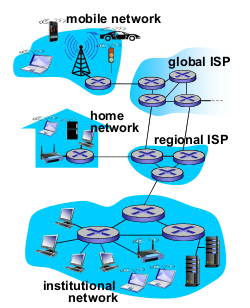
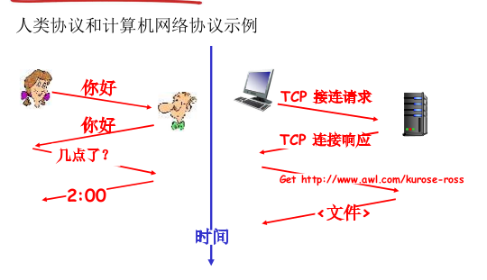

# 1.1 什么是因特网
| 5层Internet协议栈 |
| :---------------: |
| 应用层 HTTP,FTP.. |
|  运输层 TCP,UDP   |
|     网络层 IP     |
|      链路层       |
|      物理层       |

可以把因特网考虑成图论

**网络边缘(末端的节点)**：

主机/端系统(host/end system)(两个表述是等价的)：一些因特网“物品”，譬如手机电脑平板，智能冰箱，服务器
- 主机上运行的网络应用程序

**接入网，物理媒体(边)**：

通信链路(communication link)：譬如光纤，无线电

链路的传输速率以bps度量(即bit/s)

**网络核心(中间的节点)**

分组(packet)：发送端系统需要将数据分段，每段加上首部字节，以此形成信息包，称为分组

最常见的有：

- 链路层交换机(link-layer switch)：通常用于接入网(access)，也就说与末端节点相连

- 路由器(router)(在网络层)：通常用于网络核心中

画图时，习惯将主机画成方形，分组交换机画成圆形

(注：单说“交换机”，通常就是指链路层交换机)

(注：现在也有一些高级的交换机位于网络层甚至更高层)

(注：早期的交换机和路由器是分开的，但现在许多路由器也集成有交换机的功能)

因特网服务提供商ISP(Internet Service Provider)：譬如公司ISP，大学ISP，较低ISP通过国家的，国家的较高层ISP互联起来(运行IP协议)

因此结构是这样的：数台主机连接交换机，交换机又连接一台路由器，路由器则可与多台路由器互相连接，它们最后又连向某个本地/区域的ISP，最终连向国家ISP...

-----

分布式应用程序(distributed application)：因特网的应用程序运行在多个互相交换的端系统上而不是运行在网络核心的分组交换机上，因此被称为此名。

分布式应用程序是互联网存在的理由

套接字接口(socket interface)：与互联网连接的端系统提供的接口，是一个发送程序必须遵守的**规则集合**

-----

协议(protocol)：互联网有许多协议，而且它们分布在好几层，其中最重要的就是TCP和IP协议。因特网标准由IETF研发，IETF的标准文档叫做**请求评论**(**R**equest **F**or **C**omment)(最初确实是因为请求众人的评论而得名)

协议定义了(同一层)多个通信实体间交换报文的**格式**和**顺序**，以及发送/接收一条报文或事件所采取的**动作**

