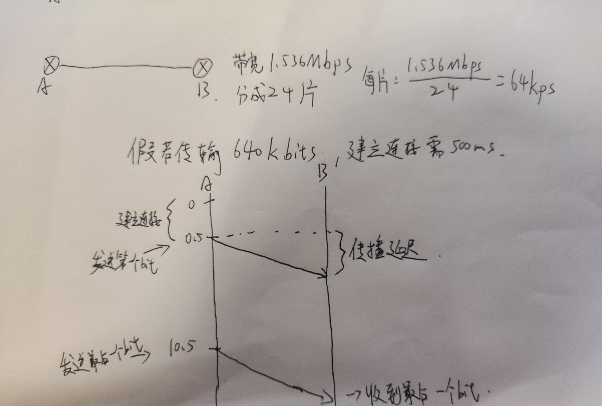

# 1.3 网络核心

网络核心：分组交换机(几乎都是路由器)和链路构成的网状网络

## 数据如何进行网络传输

有两种方法，电路交换和分组交换

### 电路交换

为每个呼叫预留一条专有电路，典型的应用就是传统的**电话网**

//图

该呼叫使用了上面链路的第二条线路(piece)，右边链路的第一条

- 需要建立呼叫(这需要时间，而且往往是秒级的，每两个节点需要给你开辟一条线路)

- 独享资源，只要呼叫建立起来就能**保障性能**
- 如果呼叫了却没有发送数据，则被分配的资源被浪费了(电话通了不说话)
- 这是一个**名副其实的连接**，路径上所有的节点都会为连接维护连接状态

#### 电路交换的复用

将网络资源(如带宽)分片

分片方式：

- 频分(**F**requency-**d**ivision **m**ultiplexing)
- 时分(**T**ime-**d**ivision **m**ultiplexing)
- 波分(**W**ave-**d**ivision **m**ultiplexing)

//图

FDM中，为每条电路专用一个频段(比如有收音机电台)，每条电路连续地获得部分带宽

TDM中，每条电路在短时间间隔中周期性获得所有的带宽(你可以类比操作系统中的进程时间片轮转，只不过在这“进程数”是固定的)

波分与频分类似，只不过波分是对于光纤的，而频分对应无线电

#### 电路交换所需时间计算

#### 电路交换不适合计算机间的通信

- **连接建立时间长**(如果你每次发都要建立连接，假如你要发的只要1ms的量，却要用500ms的连接时间，很不划算)
- 如果连接了以后没有使用，则造成很多**片的浪费**(一开始就连接好，但你只是偶尔发发数据，其他时间带宽都浪费了)
- 可靠性不高？(电路交换依赖一个核心的控制节点(它要记录节点的映射关系并且处理连接请求，如果核心控制节点宕机，那么会造成大面积的网络瘫痪))(但也不一定，有其他办法)

### 分组交换

Internet采用的就是分组交换

- 网络带宽不再分片，传输时使用所有带宽

- 传输的数据分为一个个分组

- 采取**存储-转发**的方式(转发去哪根据**路由选择协议**(自动设置路由表，走最短路径)(第五章))

  分组交换机存储一个个分组在**队列**里，轮到该分组时将其转发出去

  - 为什么要存储，如果不存储？

    如果不存储，意味着每个节点都必须立刻将其发出去，那也就意味着每个节点必须预留带宽给它，这就**退化成了电路交换**

- 由于每个节点都多出了存储的时间，因此**延迟比电路交换高**
- 如果到达速率>链路输出速率
  - 分组将会排队，于是延迟又增加了
  - 如果路由器的缓存(即队列)用完，分组会被抛弃(丢包)

### 分组交换 vs 电路交换

- 分组交换共享能力更强

假如带宽有1Mbps，有n个用户，每个用户有10%的时间活跃，活跃时以100kps恒定速率发送数据，希望n尽可能大

电路交换：由于必须预留100kps大小，很显然$$n=10$$

分组交换：给出$$n=35$$，有11或者更多用户同时活跃的概率为

$$1-\sum_{i=0}^{10}\tbinom{35}{i}{0.1}^{i}{0.9}^{n-i}$$ 如果你忘记怎么计算这个概率了，关键词：二项分布

$$\approx 0.0004=0.04\%$$

也就是说只有很罕见的情况，分组交换才会难以为继，而此时我们仍然有缓存队列可以暂时帮助我们度过难关，除非罕见情况持续很久，才会发生分组被抛弃的现象

(注：其实分组交换是无法支撑流量强度为1的情况的(到达速率=输出速率)(以后讲)，所以严谨来说，上面的sum式$$i$$最多只能是9而不是10)

另外一个场景，譬如半夜三更无人用网，在电路交换中，你仍然只能使用你的那片带宽，分组交换时则可以使用全部的带宽

- 分组交换只是尽力而为，并**不能保证可靠**，过度使用会造成网络拥塞，造成**延时和丢失**
  - 对于需要可靠的数据传输时，需要协议约束(如TCP)

- 如何提供类似电路交换的服务呢(对于流媒体来说，保证它们的带宽)
  - 第七章提到，这是一个仍未被解决的问题

## 分组交换细分

分组交换按照一段一段从源端传到目标端，按照有无网络层连接，分成：

### 数据报网络

Internet正是此方法

- 通信前无需建立连接，有数据直接传

- 每个分组独立路由(不同的数据分组路径可能不同，这可能导致**失序**)

  (每个节点的路由表随着时间可能会有变化)

- 每一个节点根据分组的**目标地址**和自己的**路由表**进行路由

  - 考虑你在杭州，你要自驾去上海海洋大学，但你不想看地图，只想问路，于是你先问一个人怎么开去上海；到了上海，你问一个人怎么去浦东新区；到了浦东新区，你问一个人怎么去南汇新城镇....(杭州这个节点路由表不需要维护怎么去海大，只要知道怎么去上海，后面自有节点知道)
  - 考虑多级ISP与现实中的国家，省，市

#### 虚电路

- 每个分组带着一个标签，标签决定下一跳(标签每过一个节点就会更新)
- 呼叫建立时决定路径，呼叫过程中路径不变
- 每个节点维护呼叫的状态信息
- 曾经的ATM网络

//图
