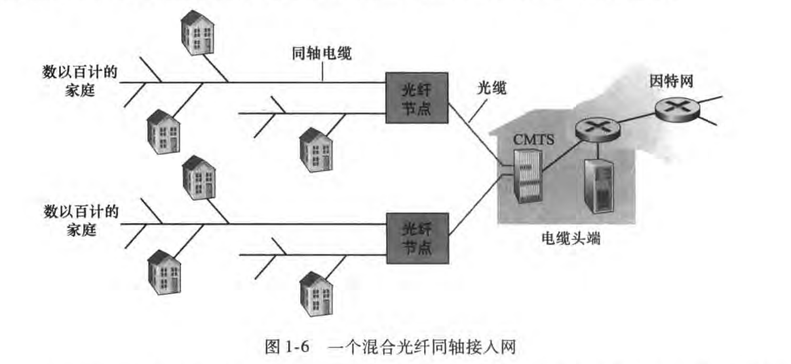

# 接入网和物理媒体

## 接入网

将端系统物理连接到其边缘路由器(edge router)的网络

使用接入网的几种环境(住宅，单位，无线)

### 住宅接入：modem

早期运营商为了避免新铺设线缆的大量成本，于是利用已有的电话线路为用户提供网络服务

拨号**调制解调器**(modem)(俗称：猫)：将上网数据**调制**成音频信号，在电话线上传输，在局端将数据**解调**出来，反之亦然(接收)

调制方法：调幅，调频，调相

(也就是所谓的把数字信号转化成模拟信号)

(调制和解调是两个过程，但通常把他们制作在同一个设备内)

(局端区分上网数据和电话信号，将上网数据发向互联网，电话信号走电话网)

电话线路大概有0～4KHz的频段是有保障的(人声范围通常为300~3400Hz)，高于4KHz不一定有保障

- 56khz的速率直接接入路由器(通常更低)
- 不能同时上网和打电话

(该技术已经被淘汰哩)

### 接入网：(Asymmetric) digital subscriber line (DSL/ADSL)

然而本地电话网到最终用户的电话线实际上往往可以提供更高的带宽，至少从最低频率到200-800kHz不等(取决于线路质量和电磁干扰等)，一种方式是：

- 双向电话信道：0～4KHz
- 中速上行信道：4KHz～50KHz
- 高速下行信道：50KHz～1MHz

如果上下行信道是对称的(即速率相同)，则称为DSL，如果不对称，则称为ADSL

类似上一种方式，这种方式要使用DSL Modem，并且用户还需要一个被动电子滤波器来分开电话信号和数据信号

(类似的，局端也会将语音传到电话网，数据传到互联网)

(显然，这是一种频分复用技术)

- 显然地，这种方式可以同时打电话和上网
- <2.5Mbps上行(typically < 1Mbps)
- <24Mbps下行(typically <10Mbps)

### 接入网：线缆因特网接入(cable Internet access)

类似DSL技术，运营商通过将现有的有线电视线路(同轴电缆)进行改造(单向改为双向)，使用cable modem进行调制解调，频分复用地在不同频段传输不同信道的数据

(当时有线电视是单向广播的，有线电视提供商用不同的频率互不干扰地在一根电缆中传送，单向的广播到每个家庭，电视的调谐器通过选取混合信号的其中一个频道)

(另外，还可以使用电力网络接入互联网，使用power modem进行调制解调，这在我国很少)

数百个家庭通过线缆连接到一个**线缆头端**(cable headend)，然后转而使用光纤连接到**c**able **m**odem **t**ermination **s**ystem，每个CMTS通常能支持500～5000个家庭，最后由CMTS接入ISP路由器

由于同时应用光纤和同轴电缆，因此它常被称作(**H**ybird **F**iber **C**oax)混合光纤同轴系统

- 非对称：最高30Mbps下行，2Mbps上行

- 各用户**共享**到线缆头端的接入网

  (与此不同的是，DSL每个用户专用线路到**c**entral **o**ffice)

### 接入网：其他技术

- 极为先进的**光纤到户**
  - 方案
    - 中心局直接连接到每户
    - 中心局连接到相对接近一些家庭的位置，然后分成每户一根
      - 分为主动光纤网络AON和被动光纤网络PON

- 通过卫星链路

### 接入网：家庭网络

现在家中的路由器具备许多功能，并最后通过猫连接出去

- 提供有线接入(WLAN)或者无线接入

- 在家庭网络与互联网之间路由
- 网络地址转换(NAT)
- 防火墙
- DHCP
- 连通家庭内网络，就像一台网络层交换机(通过IP协议)
- 甚至也有可能和猫集成在一起

### 企业接入网络

- 通过多级交换机使数据最终汇集到一起
- 然后通过一个企业路由器接入ISP(可以有几个ISP作为出口)

### 无线接入网络

#### WLAN

- 通常建筑物内部(100 ft)
- 802.11b/g标准(WIFI):11,54Mbps

#### 广域无线接入

- 由电信运营商提供 (数万米)
- 1~10Mbps (5G:数Gbps)

- 3G,4G:LTE

## 物理媒体

作为一对“发射器-接收器”之间的物理媒体(physical medium)，有：

- 导引型媒体

  信号沿着固体媒介被导引：双绞线，同轴电缆，光纤

- 非导引型媒体

  开放的空间传输电磁波或光信号，随着距离的平方成反比，**迅速的衰减**

#### 双绞线(TP)

- 两根绝缘铜导线拧合
  - 5类 100Mbps，Gbps
  - 6类 10Gbps

#### 同轴电缆

- 一根铜导线一层塑胶一层薄铜网，绝缘外皮

#### 光纤

原理关键词：全内反射

- 光脉冲
- 高速(光在光纤中大约是20万公里/s)(如10~100Gbps)

- 低误码率(不受电磁干扰)
- 安全(必须要割开光缆引出来才能窃听)

#### 无线链路

- 地面微波
- LAN
- wide-area(蜂窝)
  - 3G,4G,5G

- 卫星
  - 每个信道Kbps到45Mbps(或多个聚集信道)
  - 近地轨道卫星(如Starlink)或者同步卫星(270ms端到端不可忽略的延迟)
