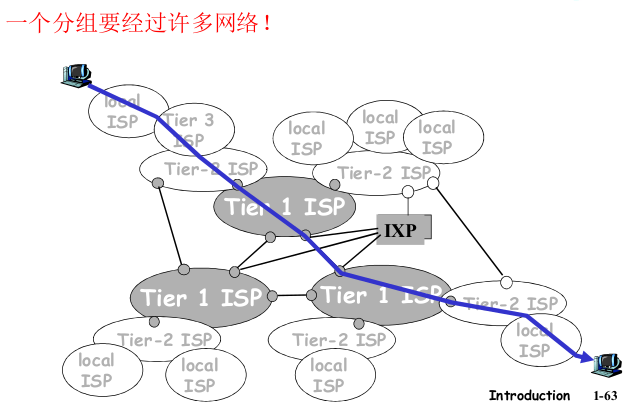
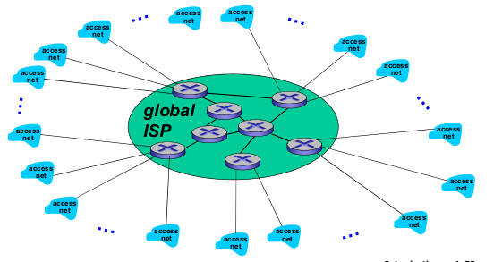
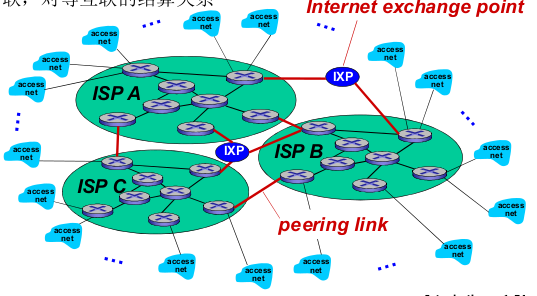
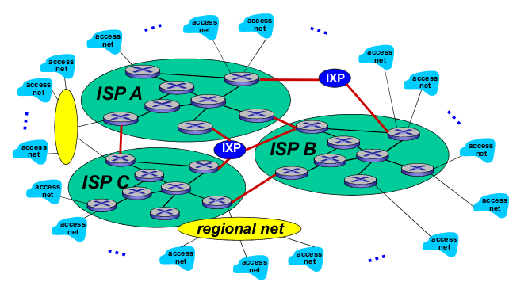
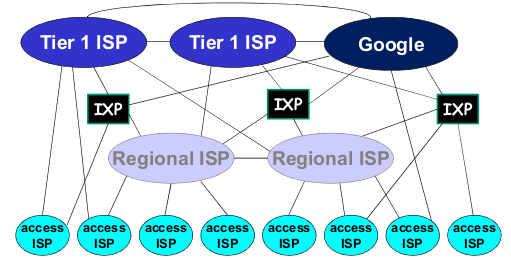

# 1.5 Internet结构和ISP(网络的网络)

ISP：Internet Service Provider 因特网服务提供商

之前我们已经了解了端系统如何接入到ISP，然而要让因特网真的构建起来(任何两个端系统可相互发送分组给对方)，必须要让ISPs相互可达，即**网络的网络**。

- 网络的网络很复杂，由于遍布全球，因此受到**经济**，**国家政策**的驱动

## 如何互联所有的ISPs(ISP有数百万个)

两两相连？不可行。成本非常高昂需要$$O(N^2)$$的连接数量，是**不可扩展**的

### 网络结构1

用单一的全球传输ISP互联所有接入ISP

- 这个全球传输ISP由路由器和通信链路构成，不但要跨越全球还要至少具有一台路由器靠近**每一个**ISPs
- 显然，建造这样的大规模网络耗资巨大，为了有利可图，必然向每个连接的接入ISP收取费用

- 此时，接入ISP被认为是客户，而全球传输ISP被认为是提供商(provider)

### 网络结构2

由于建造一个全球传输ISP是如此的有钱可以恰，自然也有其他更多的公司建立自己的全球传输ISP，与最初的全球传输ISP**竞争**

- 接入ISP无疑更喜爱*网络结构2*胜过*网络结构1*，因为现在可以根据价格(垄断会导致价格增加)和服务效果进行选择
- 全球ISP彼此互联(**合作**)，以较小的代价就可以完成业务的扩展

### 网络结构3

之前的*网络结构2*是一个两层的结构，世界上没有哪个ISP是无处不在的，有一些小的运营商，在局部地区可以更快接入更多的用户，提供更精细化的服务，因此也就诞生了区域ISP (regional ISP)，区域中的接入ISP与其相连，每个区域ISP又与第一层ISP(tier-1 ISP)(即刚才提到的全球ISP)连接

- (有趣的是，并没有一个组织来认可你是否 是一个第一层ISP)

- 每个区域也可以有多个互相竞争的区域ISP

- 这并不是意味着网络结构3是三层的，regioal ISP之下也可以是更小的regioal ISP，所以是**多层的结构**

  在中国，市级ISP向省级ISP连接，省级ISP又连向国家级ISP，国家级ISP最后连向第一层ISP [Tian 2012]

- 每一层都有客户-提供商关系，意味着，如果你是位于第n层的ISP，你需要向你连接的n-1层ISP付费，第一层ISP不需要向任何人付费

### 网络结构4

给*网络结构3*稍作增添

- **PoP**(Point of Presence)(下连上)，PoP是上级ISP的一个或多个路由器群组，提供给下级ISP连接。(根据流量收费)
- 任何非第一层的ISP都可以选择**多宿**(multi-home)(下级ISP与两个以上上级ISP连接)，譬如一个接入ISP可以与两个区域ISP连接，这样即使一个提供商出现故障，也可以继续提供服务
- 同层的ISP互相连接，称为**对等**连接peering link(通常，同层的ISP不会向对方收费)，非第一层的同层ISP通过对等连接可以免去它们之间的所有流量费用
- 第三方公司可以创建一个因特网交换点(**I**nternet E**x**change **P**oint, IXP)，IXP可以提供给多个ISP在其中一起对等连接，IXP也可以提供给不同层的ISP一起连接

### 网络结构5

*网络结构5*在*网络结构4*顶层增加了互联网内容提供商(Internet Content Provider,ICP)

比如google

ICP出于减少高额的网络费用，同时还能为用户提供更好的服务：

- 与低层的ISP的连接(直接或者通过IXP)，尝试**绕过高层ISP**
  - 譬如apple在贵州设立一个数据中心，那么国内访问至多只需要通过国家ISP即可访问到，而无需走国际到第一层ISP(apple省钱而且用户访问更快)
    - 即使访问的是apple在贵州没存储的数据，apple也可以通过自己的专用线路去访问世界上的其他的数据中心，无需通过第一层ISP
    - 题外话：设立数据中心的位置需要考察，需要避免地震，战争等天灾人祸，考虑网络和电力费用(含散热)(什么微软欢乐海底数据中心)
- 由于仍然存在用户通过第一层ISP访问，所以ICP仍然需要与第一层ISP相连

