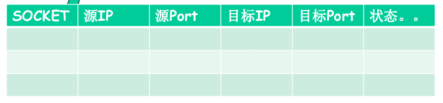
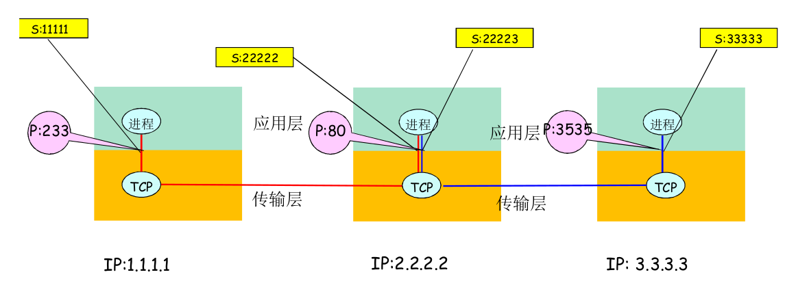
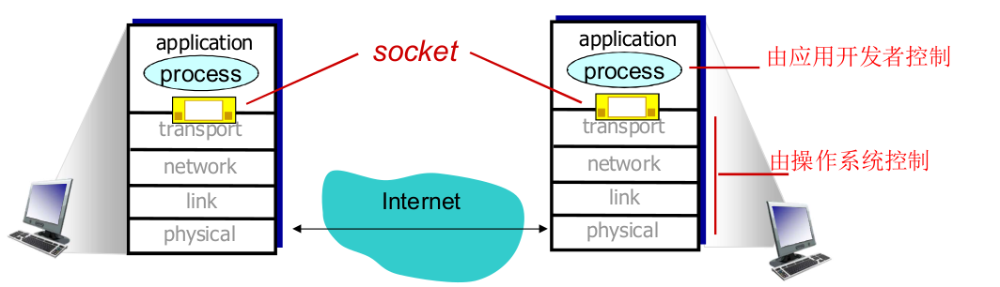
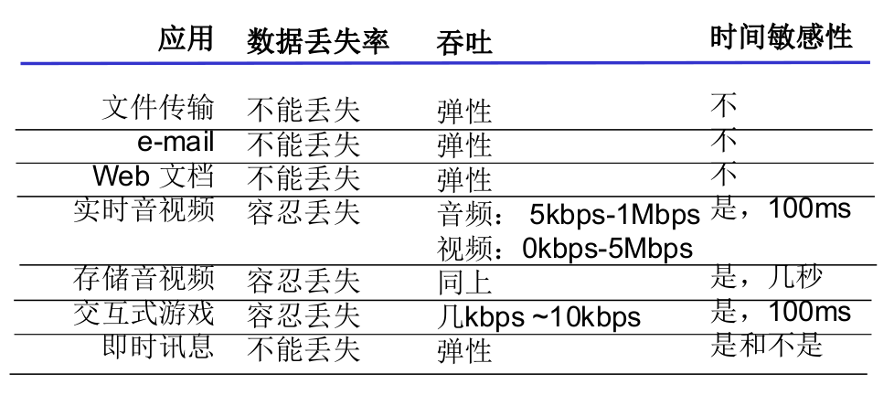

# 2.1 应用层原理

感觉这节课有点啰嗦(逃)

## 网络应用体系结构

这个在1.2中有所提到

### C/S模式(客户/服务器)

- 服务器一直运行
- 服务器显然需要固定的ip和周知的端口
- 扩展性差，随着访问量的增大，性能断崖式下降
- 客户端可以是动态ip，间隙连接
- 客户端不可与其他客户端直接通信

### p2p模式(对等)

- (几乎)没有一直运行的服务器
- 任意端系统间可以进行通信
- 每个节点既是客户端又是服务器
  - 自扩展性
- 自扩展性
- 参与主机间歇连接，可改变ip
  - 难以管理

### 混合模式

如

#### Napster

- 主机在中心服务器注册资源
- 主机向中心服务器查询资源位置
- 任意peer节点间进行文件传输

#### 即时通信

- 用户上线时，向中心服务器注册ip
- 用户与中心服务器联系，以找到其在线好友位置

## 进程通信

- 同一主机内，两进程通过os提供的进程间通信机制通信(如Linux管道)

- 不同主机，通过交换报文来通信(Message)

  - 借助传输层提供的服务。使用os提供的通信服务

    (那么传输层和os系统调用的关系是？存疑，知道了以后来改)

我们把发起通信的进程称作**客户端进程**，等待连接的进程称为**服务器进程**

- 即使是p2p模式下，也可以根据动作关系把两个peer应用分为客户端进程和服务器进程

## 分布式进程通信需要解决的问题

### 进程编址

- 主机：32位ip地址
- 端口号(port numbers)(在一台主机上区分不同的进程)
- 所使用的传输层协议(TCP or UDP)

(知名端口号：HTTP：TCP80，Mail：TCP25，ftp：TCP2)

ip+port表示一个端节点

(注：TCP和UDP各有一套端口号)

### 穿过层间的信息

- 要传输的报文(即SDU)

- 自己的应用进程标识：IP+TCP(UDP)端口号

  (谁传的)

- 对方的应用进程标识：对方的IP+TCP(UDP)端口号

  (传给谁)

(tcp和udp根据这些信息封装报文段，并且递交给ip层)

Socket API使用一个代号表示通信的双方(或单方)

(这样就无需每次都传输完整的通信信息了)(考虑C语言中，传一个整数i给函数，就是告诉函数，使用某个数组中的下标为i的元素)

(存疑)(这里老师说，作用是传输报文携带更少的信息不易出错，但我认为主要目的应该是减少性能开销，因为Socket API应该类似是本机上的一个函数调用，众所周知本地内存读写是很不容易出错的)

#### TCP Socket

一个int代号    **一一对应**   一个四元组(四元组是{源ip，源端口，目标ip，目标端口}

- (什么是“一一对应”？请上网自行搜索双射或者一一对应)

- (类似OS打开文件，他也会返回一个文件描述符给你，一个文件描述符与一个文件一一对应，这样就不必每次读写都传文件路径参数和偏移量参数了)

因此TCP socket在建立连接时，传入这个四元组，API返回一个整数代号，之后就可以使用这个代号进行报文发送了

所以一个端口是可以被两个进程同时使用的

#### UDP Socket

- UDP无需建立连接
  - 每个报文独立传输
  - 前后报文可能给不同的分布式进程

一个int代号    **一一对应**   一个二元组{源ip，源端口}

- 每次传输报文都要提供对方的IP和port

### 套接字(socket)

套接字即网络套接字，实际上译为**网络插座**或者**网络接口**更妥帖

进程通过套接字发送报文或接受报文

## 可供应用程序使用的运输层服务

- 可靠性
  - 有些应用需要100%的可靠(如文件)
  - 有些应用能容忍一定比例下的数据丢失(如音频)

- 吞吐
  - 有些应用需要最小限度的吞吐以保证应用有效运转(如多媒体)
  - 弹性应用能够根据当前带宽或多或少的利用可供使用的吞吐量

- 延迟(定时保证)
  - 有些应用出于有效性考虑，对数据传输有严格时间限制(如网络电话，交互游戏)

- 安全性
  - 机密性
  - 完整性
  - 可认证性(鉴别)

## TCP与UDP服务

### TCP服务

- 可靠的传输服务
- 流量控制
- 拥塞控制
- 面向连接
- 不能提供：时间保证，最小吞吐保证，安全

### UDP服务

- 不可靠数据传输
- TCP行的它都不行

#### 为什么要有UDP

- UDP可以区分进程，IP不行
- UDP无需建立连接，省时间
- 可靠也需要时间代价
- 没有流量控制和拥塞控制，**应用能够按照设定的速度发送数据**(TCP应用发送速度与实际速度不一致)

## 安全的TCP

SSL在TCP之上实现，提供加密的TCP连接

- 私密性

- 完整性

- 端到端鉴别

- SSL在应用层(不严格，一说传输层)

  (这像是一个“多出的层”，因为应用使用SSL库，SSL使用TCP)

- 应用将明文给SSL socket，SSL将其加密并在互联网上传输
