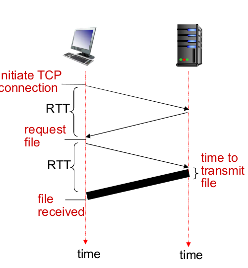
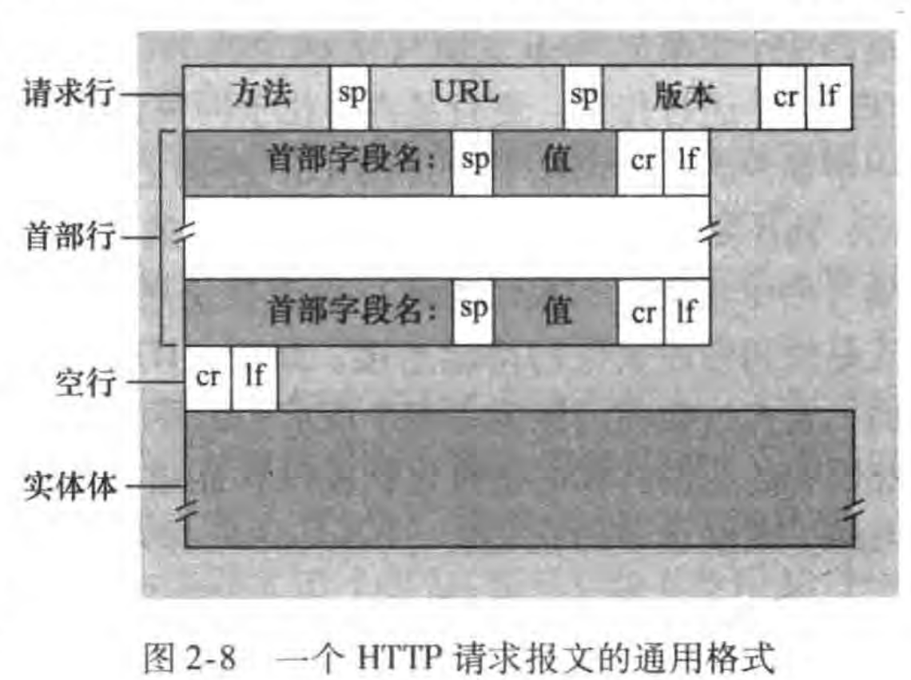
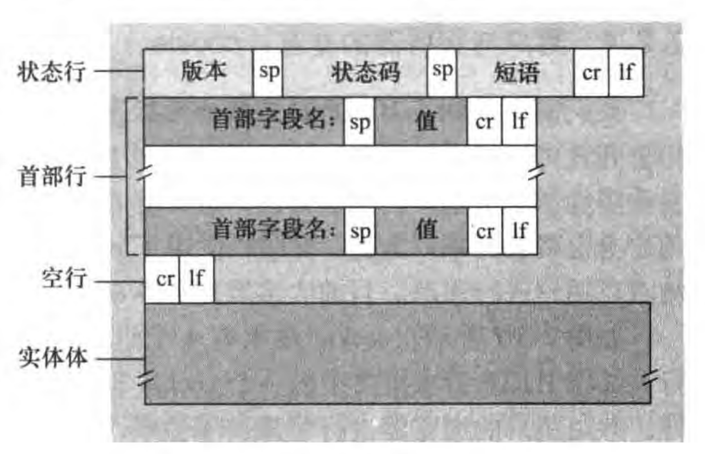
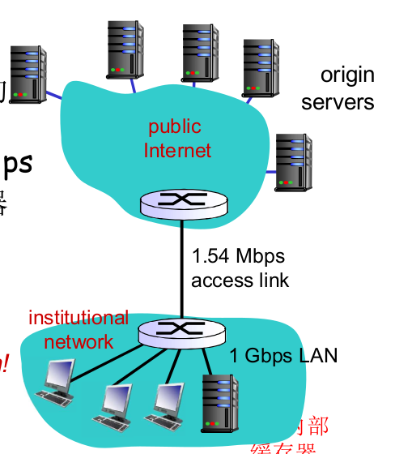
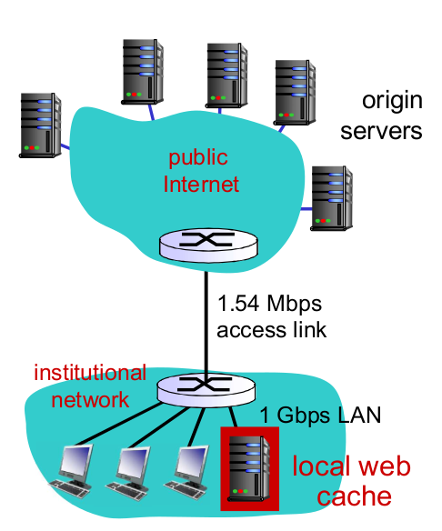

# 2.2 Web与HTTP

## 术语

- www (World Wide Web)万维网

- HTTP(HyperText Transfer Protocol)超文本传输协议

- Web页面：

  - 由对象(对象是一个文件)组成

  - 对象可通过一个URL寻址
  - 通常含有一个基本的html文件，该基本html文件又包含若干对象的引用(URL)

- URL：

  `[协议类型]://[访问凭证信息]@[服务器地址]:[端口号]/[资源文件路径][文件名]?[查询]#[片段ID]`

  - 其中[访问凭证信息]、[端口号]、[查询]、[片段ID]为可选
  - 访问凭证信息形式可以是`user:psw`

## HTTP概况

- web的应用层协议
- C/S模式
  - web浏览器
  - web服务器

- 使用TCP
  - 端口80

- HTTP是无状态的(服务器不维护关于客户的任何信息)
  - 维护状态的协议
    - 很复杂
      - 必须维护历史信息(状态)
      - 如果服务器/客户端死机，则状态信息可能不一致
    - 无状态的服务器能支持更多的客户端(维护状态需要性能)

## 响应时间模型

往返时间 RTT (round-trip-time )：一个小的分组从客户端到服务器，在回到客户端的时间（传输时间忽略）



## HTTP连接

- 非持久HTTP
  - 最多仅一个对象在TCP连接上发送
  - 下载多个对象需要多个TCP连接
  - HTTP/1.0使用非持久

- 持久HTTP
  - 多个对象可在一个TCP连接上传输
  - HTTP/1.1默认持久(可配置为非持久)

### 非持久HTTP


```pseudocode
//假设请求10个对象
for(i=1;i<=10;i++){
	客户端请求连接;服务器接受连接并通知客户端;//需要一个RTT
	请求第i个对象;服务器将对象封装在报文里发回客户端;//需要一个RTT+文件传输时间
	关闭TCP连接;//(存疑)或许也需要一个RTT？
}
//因此共需20个RTT+10个文件传输时间
```

(尽管我们说TCP需要三次握手，但其实在这，第三次握手和请求对象是一起发过去的)

#### 缺点

- 每个对象需要两个RTT
- 操作系统需要为每个请求对象的TCP连接分配资源，而且浏览器通常并行TCP连接获取引用对象：web服务器负担大

## 持久HTTP

```pseudocode
//假设请求10个对象
客户端请求连接;服务器接受连接并通知客户端;//需要一个RTT
for(i=1;i<=10;i++){
	请求第i个对象;
	wait(服务器发回对象);//非流水方式。流水方式一连串的请求不必等待上一个对象返回
}
关闭TCP连接;
//非流水需要11个RTT+10个文件传输时间
//对于小的对象(传输时间忽略不计)，流水线有可能只需要2个RTT
//对于较大的对象，流水线需要2个RTT+10个文件传输时间(不准确)
```

- 发送请求后，仍然保持连接，即后续的请求和报文通过相同的TCP连接传送
- HTTP/1.1默认流水线

## HTTP报文格式

### 请求报文

执行`curl -v http://81.68.182.133/net/ #Linux`

(curl是Linux中非常常用的命令行工具，作用就是请求web服务器)

(你也可以使用telnet命令)

- 两种类型报文：请求，响应

观察请求报文

```
> GET /net/ HTTP/1.1
> Host: 81.68.182.133
> User-Agent: curl/7.68.0
> Accept: */*
> 
```

- ASCII(人能阅读，便于调试)
- 第一行称作**请求行**(request line)，后继行称作**首部行**(header line)，空行之后可能跟上一个实体部分

- 请求行有3个字段，方法字段，URL字段，HTTP版本字段
  - 方法字段(如GET,POST,HEAD,PUT,DELETE...)

- 首部行
  - host指明对象所在主机(这是需要的，需要提供给web代理缓存服务器(后面说))
  - Connection: close(我的例子中没有)，告诉服务器不要使用持久连接，发完对象就关闭连接
  - User-agent：指明用户所使用的浏览器，这里我们使用的是curl命令
  - Accept-language：(我的例子中没有)用户想得到对象的某个语言版本
  - Accept：告诉服务器，用户浏览器能够处理的媒体类型以及优先级



#### 方法字段类型

- GET(绝大多数请求都是GET)

  请求一个对象

- POST

  通过表单输入提交给服务器

  - 请求报文实体部分即表单内容

- HEAD(常用于调试，搜索引擎等)

  类似GET方法，但服务器只用报文回应，不返回请求对象

- PUT(常用于服务器管理员)

  将实体中的文件上载到URL字段规定的路径

- DELETE

  删除URL字段规定的文件

### 响应报文

观察响应报文

```
< HTTP/1.1 200 OK
< Server: nginx
< Date: Mon, 10 Oct 2022 11:08:03 GMT
< Content-Type: text/html
< Content-Length: 10873
< Last-Modified: Mon, 10 Oct 2022 11:00:11 GMT
< Connection: keep-alive
< Vary: Accept-Encoding
< ETag: "6343fb3b-2a79"
< Accept-Ranges: bytes
< 

<!DOCTYPE HTML>
<html lang="" >
    <head>
        <meta charset="UTF-8">
        <meta content="text/html; charset=utf-8" http-equiv="Content-Type">
...        
...
```

- 第一行**状态行**，后继行**首部行**，最后还有**实体**

- 状态行有三个字段：协议版本，状态码，状态码对应的状态信息
- 首部行
  - Server：这是一台nginx服务器
  - Date：服务器产生并发送报文的日期和时间
  - Content-Type：实体对象是HTML文本
  - Content-Length：被发送对象的字节数
    - 为什么要有：由于TCP可能会把一个实体分成几份，所以我们期望可以知道什么时候我们收完了这个实体(相当于助于划分边界)
  - Last-Modified：最后的修改日期(这对于本地缓存或者网络缓存服务器很有帮助，一会说)
  - Connection: keep-alive：TCP连接保持着，这是一个持久连接

- 可以看到，实体里确实是一个HTML文件



#### 常见响应状态码

- 200 ok

  成功辣

- 301 Moved Permanently
  - 请求的对象已经被永久转移了；新的 URL 在响应报文的 Location:
    首部行中指定
  - 客户端软件自动用新的 URL 去获取对象

- 400 Bad Request

  该请求不能被服务器解读

- 404 Not Found

   请求的文档在该服务上没有找到

- 505 HTTP Version Not Supported

## cookie

之前的HTML是无状态的，使用cookie可以识别不同用户

cookie技术的四个组件

- 响应报文的一个cookie首部行

  如`Set-Cookie: 1678`

- 在请求报文的一个cookie首部行

  `Cookie: 1678`

- 用户端系统保留一个cookie文件，由用户浏览器进行管理
- web站点有一个后端数据库

譬如某个cookie值可以作为某个用户唯一的ID，以此来索引后端数据库的一个项。服务器可以根据cookie和用户行为不断的更新数据库内容

你可以使用`curl --head cn.bing.com`来查看响应报文中的一些`Set-cookie`

### cookie基本结构

- 名

- 值

- 各种属性

  一个cookie可以有多个属性如：

  - `Domain`和`Path`定义cookie范围
  - `Expires`定义浏览器应该何时删除cookie，`Max-Age`将cookie的过期时间设为某段时间后
  - `Secure`旨在将cookie加密，使浏览器仅通过加密连接使用cookie
  - `HttpOnly`要求浏览器不要通过HTTP/HTTPS以外的渠道使用cookie
  - 等等

### Cookie的作用和争议

#### 作用

如

- 用户验证
- 购物车
- 推荐
- 用户状态

#### 隐私

- Cookie允许站点知道许多关于用户的信息(如网页的操作(用户行为/爱好))
  - 站点可能将这些信息卖给第三方，如广告公司

- 使用重定向和cookie的搜索引擎可以知道用户更多的信息
  - 某个用户在大量站点上的行为，个人浏览方式的大致模式

## Web缓存

~~cache：没错又又又又是我，我就是大名鼎鼎，无处不在的cache~~

web缓存器(Web cache)又叫代理服务器(proxy server)

```pseudocode
浏览器向目标主机A请求一个对象obj
浏览器与proxy建立TCP连接，向proxy发送HTTP请求
if(proxy中有obj)
	proxy直接将obj返回给客户浏览器
else
	proxy和目标主机A建立TCP连接，请求该对象
	目标主机A将对象传给proxy
	proxy把这个对象在本地存储一份副本
	proxy把这个对象传回给客户浏览器
```

- proxy既是客户端又是服务器
- 通常缓存由ISP安装(大学，公司，居民区ISP)

### 使用web cache的好处

- 降低客户端的请求响应时间
- 大幅减少一个机构内部网络与Internet接入链路上的流量
- 互联网大量使用缓存，使得较弱的ICP也可以有效提供内容(访问减少，服务器压力下降，同时流量也会减少)

#### 安装本地缓存例子



假设

- 平均对象大小=100kb
- 机构内浏览器对原始服务器平均请求率=15/s
- 因此平均的接入链路流量速率为1.5Mbps
- 机构内部设备到机构路由器的时间为10ms，机构路由器到原始服务器为2s延时
- 接入链路带宽为1.54Mbps

由于流量强度$$=\frac{1.5Mbps}{1.54Mbps}\approx0.99$$趋于1，因此时延非常大，将达到**分钟级**

##### 解决方法1：更大带宽

将接入链路带宽升级到154Mbps，流量强度将下降到$$\approx 0.01$$，此时排队时延非常小为毫秒级，因此总时延大致为2s

- **代价**：增加接入链路带宽往往非常昂贵

##### 解决方法2：安装本地缓存



假设缓存命中率为0.4

因此将有60%的请求采用接入链路，接入链路的流量强度变为$$=\frac{1.5Mbps\times60\%}{1.54Mbps}\approx 0.58$$

一般而言，**当流量强度小于0.8时时延较小，约为几十毫秒**，对于2s而言可以忽略不计

此时平均时延为$$0.6\times2.01+0.4\times0.01\approx1.2s$$

这甚至比第一种方法更快，而且比较便宜！

(用户高兴，公司高兴，ICP也高兴)(ISP：呜呜呜没卖到带宽的钱)

##### 另

通过使用**内容分发网络** (Content Distribution Network, **CDN** )，web缓存在因特网发挥越来越强的作用(2.6节详细讨论)

- 有共享，也有专用的
- 在某个服务器故障时，甚至可以进行异地备援

### 条件GET

使用网络cache的一个问题是，**cache内的对象可能是陈旧的**

因此我们有条件GET

- 使用GET方法
- 首部行包含一个`If-Modified-Since`行，表明缓存拷贝的日期
  - 如果缓存在此日期之后没有被修改，则目标服务器仅仅返回一个报文表示未被修改，不返回对象实体(304 Not Modified)
  - 不然：目标服务器返回报文和对象实体

(发散思考(我想的，书上并没有))：对于某些文件，有没有可能服务器使用git进行版本控制，然后条件GET如果修改了，仅仅返回那个版本之后被修改的部分

(这样可以进一步节省流量)

(代价是服务器需要维护之前的版本(而不是仅最新)，这需要硬盘空间)

(并且HTML协议实现也会复杂一些，响应也会因为需要判断版本差异而变慢)
