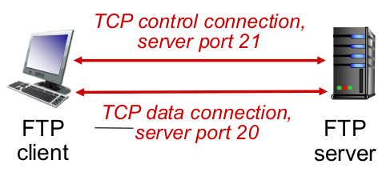

# 2.3 FTP

**F**ile **T**ransfer **P**rotocol，用于在计算机网络上，客户端和服务器之间进行文件传输的应用层协议

## FTP控制连接与数据连接分开

- FTP客户端与FTP服务器通过端口21联系(使用TCP)(21为控制流)
- 通过控制连接
  - 客户端获得身份确认
  - 客户端发送命令浏览远程目录
  - 客户端发送文件传输命令(并且开始监听一个本地端口)

- 服务器收到文件传输命令，打开一个到客户端的数据连接(连接客户端正在监听的端口)(第二个TCP)(用于传输文件)

(因此我们称控制连接是一个**带外**(out of band)传送)

(实际上，这是主动模式的FTP，而还有被动模式的FTP(两条连接都是客户端去连服务器)(这可以避免客户端防火墙问题))

- FTP服务器会维护用户的状态信息(即：**有状态**)

  (当前路径，用户账户，控制连接对应)

## FTP命令，响应报文

(与HTTP非常相似)

命令样例：

- **控制连接**上以**ASCII**文本传送

  - 如`USER username`,`PASS password`,`LIST`(请求服务器返回当前目录的文件列表),`RETR/STOR filename`客户端下载/上传服务器文件

    (注：通常我们的下载/上传术语，都以客户端为主体，也就说当我们说下载，永远指的是“客户端向服务器下载文件”，不可能是“服务器从客户端下载文件”)

返回码样例：

- 含状态码和状态信息

- 331 Username OK
- 125 data connection already open;transfer starting
- 425 Can't open data connection
- 452 Error writing file

## 安全性

FTP**非常不安全**

由于FTP将用户名密码以明文形式在互联网上传输，因此一旦被抓包，就被破解了，此外还有非常多种方式破解

- 因此，从前支持FTP协议的Chrome，Firefox，edge浏览器等，目前已经全部停止支持FTP
- 当然你仍然可以用一些下载管理器使用FTP
- 因此有一些安全的协议：
  - FTPS(FTP-SSL或称FTP Secure)安全的FTP
  - SFTP(SSH File Transfer Protocol)(它与FTP/FTPS毫无瓜葛，不要混淆)：基于SSH2.0的扩展提供安全文件传输能力
  - SCP(secure copy)：也是通过SSH实现的
