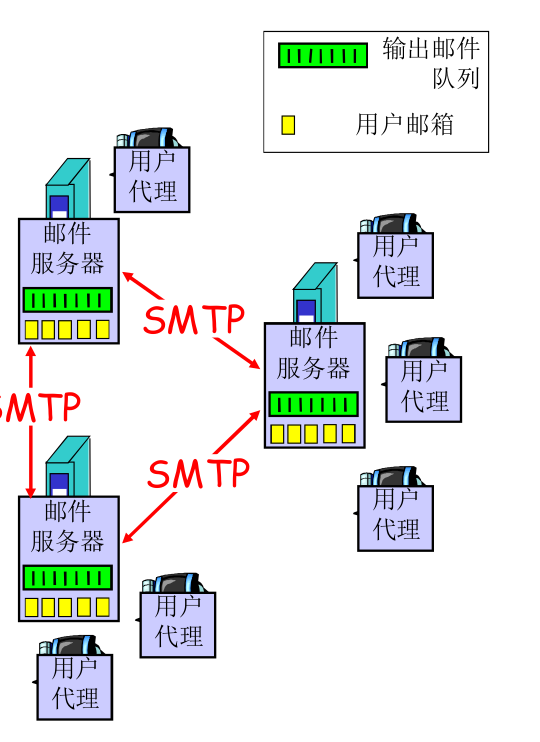
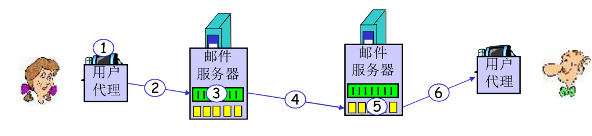
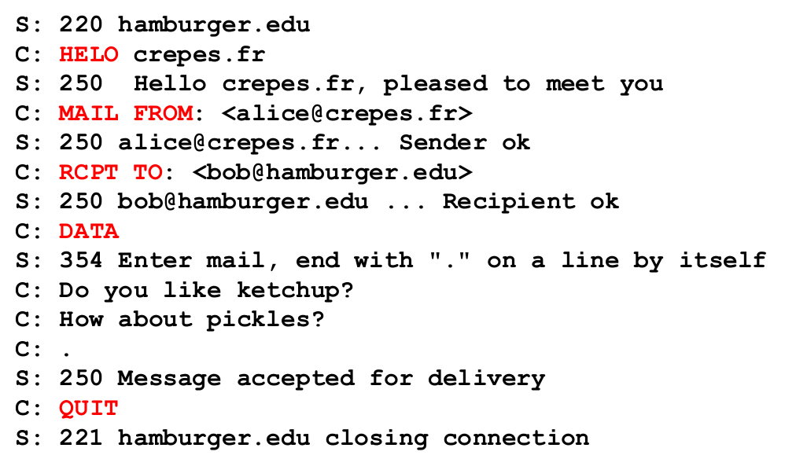
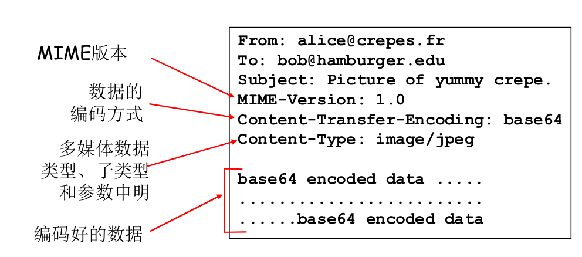
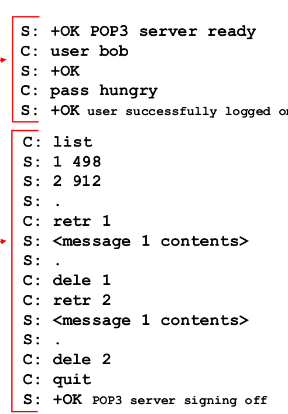

# 2.4 Email

## Email

3个主要组成部分

- 用户代理(user agent)

  (可称之为“邮件阅读器”，撰写编辑阅读转发保存邮件)

  - 如Outlook，Apple Mail甚至浏览器

- 邮件服务器

- 简单邮件传输协议(Simple Mail Transfer Protocol, SMTP)

## 邮件服务器

- **邮箱**中管理，维护用户的收件
- 输出**报文队列**(存放待发送邮件报文)
- 在邮件服务器之间通过**SMTP**协议，发送email报文
  - 此时，客户是发送方邮件服务器
  - 服务器是接受方邮件服务器



## 举例



其中“发送(**推**)邮件”使用的是SMTP协议，(标号2和标号4)

而用户代理向邮件服务器“**拉取**邮件”(如果你经常使用git，你应该深刻理解“拉取”(pull)的含义)，可以使用POP3或者IMAP甚至HTTP协议(标号6)

1.Alice使用用户代理编写邮件，收件人是bob@someschool.edu

2.Alice的用户代理**通过SMTP**发给她的邮件服务器，服务器将邮件放在报文队列中等待发出

3.Alice的邮件服务器打开一个到Bob邮件服务器的TCP连接

4.Alice的邮件服务器作为客户端，**通过SMTP**发送给Bob服务器

5.Bob的邮件服务器将邮件放到Bob的邮箱

6.另外某个时刻，Bob通过用户代理和可能的三种协议**(POP3/IMAP/HTTP)**拉取Bob邮件服务器上邮箱里的邮件并查看

## SMTP

### SMTP基本

- 使用TCP，端口25
- SMTP使用持久连接
- 多个对象包含在一个报文中
- 直接传输
  - 握手
  - 传输报文
  - 关闭

- 命令：ASCII
- 响应：状态码和状态信息(类似HTTP)

- **报文必须为7位ASCII码**

  (SMTP的问世比HTTP更早(约80年代)，当时的网络根本不足以承载图片/音频...，当时看是很明智的)

#### 与HTTP比较：

- 相对于HTTP主要是一个“拉”的协议，SMTP则是一个“推”的协议
- 都是ASCII的命令，响应，状态码
- HTTP每个对象一个报文，SMTP多个对象一个报文

### SMTP交互



可以尝试使用telnet来进行SMTP交互(你可能需要研究一下SMTP-AUTH扩展)

### 基本SMTP的缺陷与改进

- 没有**身份认证**(张三的情敌可以伪装张三，给其女友发分手邮件)

  改进：SMTP-AUTH扩展

- 尽管与了身份认证，**垃圾邮件**仍然是一个主要问题

- SMTP只能发送7位ASCII文本，我们希望可以发送多媒体或者二进制文件

  改进：MIME(**M**ultipurpose **I**nternet **M**ail **E**xtensions)提供规范，将二进制内容映射成ASCII编码(如base64)

  (base64不是加密方法，base64仅仅是编码方式)

- 明文在互联网上传输非常不安全

  改进：通过SSL加密的SMTPS

### 邮件报文格式

(注：这与之前的“SMTP交互”是不同的(尽管from，to很相似)，“SMTP交互”介绍的是SMTP如何握手，而这是发送的邮件应该的格式)

```pseudocode
//此处是SMTP交互
S: 220 smtp.example.com ESMTP Postfix
C: HELO relay.example.com
S: 250 smtp.example.com, I am glad to meet you
C: MAIL FROM:<bob@example.com>
S: 250 Ok
C: RCPT TO:<alice@example.com>
S: 250 Ok
C: RCPT TO:<theboss@example.com>
S: 250 Ok
C: DATA
S: 354 End data with <CR><LF>.<CR><LF>
//从此处开始是邮件报文
C: From: "Bob Example" <bob@example.com>
C: To: Alice Example <alice@example.com>
C: Cc: theboss@example.com
C: Date: Tue, 15 Jan 2008 16:02:43 -0500
C: Subject: Test message
C: 
C: Hello Alice.
C: This is a test message with 5 header fields and 4 lines in the message body.
C: Your friend,
C: Bob
C: .
//此处是邮件报文的结束
S: 250 Ok: queued as 12345
C: QUIT
S: 221 Bye
{The server closes the connection}
```

- 由首部行和主体构成

  - 首部行

    如To,From,Subject
    
  - 主体
  
    报文内容(ASCII)

- 可以注意到，交互中，服务器通过`354 End data with <CR><LF>.<CR><LF>`指明了邮件报文应该以一个"."结束

#### MIME

MIME为SMTP提供传送非文本文件(如多媒体/二进制)的能力

- MIME的头部添加在SMTP**邮件报文头部的附加域**

  - 指明MIME版本

  - 数据编码方式，如base64

    ` Content-Transfer-Encoding: [mechanism]`

  - 内容类型(如各种多媒体，二进制/程序，3D模型)

    `Content-Type: [type]/[subtype]; parameter`

    - type和subtype指明文件类型
    - parameter是可选的附加信息，更多是指明文本的编码方式(charset)

- 后面跟上编制好的数据



## 邮件访问协议

### POP3

**P**ost **O**ffice **P**rotocol

三个阶段

- 用户确认阶段(登录)
  - `user`,`pass`
  - 服务器将以`+OK`,`-ERR`来反馈
- 事务处理阶段(下载/删除/取消删除邮件)
  - list：列举报文(邮件)号列表，以及它们的长度
  - retr：根据报文号下载报文
  - dele：删除
  - quit
- 更新(POP3 quit以后，服务器对用户在事务处理阶段做出的要求进行更新，(如删除邮件))



- POP3可以下载并删除，也可以下载并保留
- POP3在会话中是无状态的

### IMAP

- 可以使用文件夹管理邮件服务器上的邮件(POP3只能在本地用文件夹管理)
- IMAP比POP3复杂很多
- 支持MIME，可以使用户无需下载附件即可浏览消息内容
- 有状态的
  - 维护报文和文件夹关系
  - 当前目录
