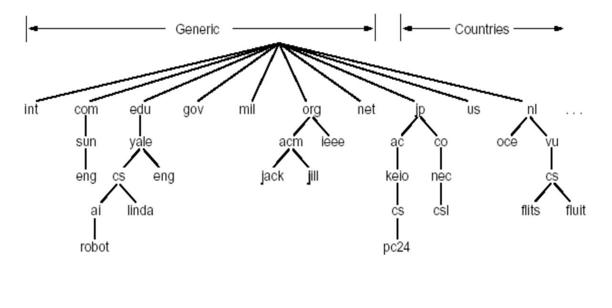

# 2.5 DNS
IP地址可以标识主机/路由器，但不便于人类的记忆

因此我们使用主机名(hostname)来标识主机，如www.google.com

然而主机名几乎不含有主机在互联网哪处的信息(IP地址含有层次化的在哪的信息)，并且不定长的字符串也不便于路由器使用

因此我们需要**DNS来将主机名转换成IP地址**

## DNS要解决的问题

1.如何命名设备(好记+解决重名)

2.如何把名字转换成IP

3.如何维护：增加或删除一个域

### 早期的ARPANET名字解析方案
- 单一服务器，通过一个文件维护映射关系
- 每台主机定期从单一服务器取文件
- 主机名没有层次(任意字符串)
问题，主机数量很庞大时
- 一旦该服务器崩溃，互联网随之瘫痪
- 带宽以及巨大访问带来的服务器压力
- 非常频繁的维护
- 使用文件维护效率低下
- 无法解决重名问题

## DNS工作机理概述

- 层次化(树状)，基于域的命名
- 分布式，层次数据库完成命名
- DNS服务器层次结构是树状的，采用**递归或者迭代查询**获取域名对应的IP
- UDP，端口53
  - UDP对服务器压力更小
- 虽然是核心的互联网功能，但却在网络边缘以应用层协议实现
- **多个主机名可以指向一个IP地址，一个主机名也可以对应多个IP地址**
  - 可以取别名
  - 通过一个主机在不同的地区/时间对应不同的ip地址，可以做到**负载均衡**
- DNS也会将邮件服务器**别名**转换成邮件服务器**正规名字**

## DNS名字空间

- DNS采用层次**树状**的命名方法
  - Internet根划分为几百个顶级域(top level domains,TLD)(树根直接连接的域名节点)
	- 通用的(generic)
	  .com .edu .gov .int .org 等等(当然还有极为欢乐的.xyz(好便宜))
    - 国家的
	  .cn .us .jp .nl
  - 每个域下(树枝节点)，可划分为为若干子域(subdomains)
  - 树叶节点是主机名



域名(字符串)

- 使用"."分隔每个节点
- **从右到左**，即是从树根直到本域节点的路径
- 如ustc.edu.cn，cn是根节点下的顶级域，edu是cn下一层的域，ustc则是edu下一层的域

域名既可以指表示一个域，也可以表示一个主机(就是说主机名是域名含义上的真子集)

域名的管理
- 每个域管理其下的子域
  如.cn划分为edu.cn com.cn等
- 创建新域必须征得所属域的同意
- 域的划分遵循逻辑和组织的界限，而不是物理的
  - 一个域的主机可以不在一个网络
  - 一个网络的主机也未必在一个域

## DNS服务器

- **根服务器**由13个不同的组织管理，存有顶级域服务器对应的IP

- 每个顶级域都有自己的**TLD服务器**

- **权威DNS服务器**

  考虑一个组织要为其下域名提供解析，那么它必须实现自己的权威DNS服务器，或者支付费用请求某服务提供商将记录存储在服务提供商的权威DNS服务器

- **本地DNS服务器**


如图，yale的其他学院的服务器域名对应关系存储在yale的权威DNS服务器，而CS学院自行实现权威DNS服务器为其下域名提供解析

(DNS服务器仍然是一个树状图(注意区分：名字空间图))

### 本地DNS服务器以及DNS缓存

- 不严格属于层次结构
- 每个ISP(如居民区iSP，公司，大学)，都有本地DNS服务器
- 主机发送一个DNS查询时，查询会先送到本地DNS服务器
  - 代理
  - DNS缓存(目的：提高效率)
    - 如果服务器缓存了，则立即返回结果
    - 如果没有缓存，则代替主机进行DNS查询，并且缓存这个结果
    - 缓存结果与权威资源记录不一致：
      - 使用TTL维护记录，过期抛弃

(很多时候因为有缓存的情况，根服务器以及TLD都会被绕过)

(并不是只有本地DNS服务器才有DNS缓存，DNS服务器通常都有)

### DNS服务器查询方式

#### 递归查询


在树中查询，使用递归是很自然的想法

问题：根服务器负担太重

#### 迭代查询


- 每个DNS服务器返回的是下一跳的DNS服务器地址，而不是代为查询
- 你向下一跳的DNS服务器询问
- 直到最后某个权威名字服务器给出解析结果

实践中，两种方式都有，一般主机到本地DNS服务器为递归查询，而本地DNS服务器到其他DNS服务器为迭代查询

## DNS协议/记录/报文

### 资源记录

- 4元组(Name ,Value,Type,TTL)

| Type  |          Name          | Value                  |                              |
| ----- | :--------------------: | ---------------------- | ---------------------------- |
| A     |         主机名         | IP                     | 标准映射                     |
| NS    |          域名          | 权威DNS服务器的主机名  |                              |
| CNAME |       主机名别名       | 规范主机名             |                              |
| MX    | 邮件服务器的主机名别名 | 邮件服务器的规范主机名 | 允许邮件服务器拥有简单的别名 |

### 报文


- 查询和回答报文具有一样的格式

- 首部
  - 标识符，16bit数
    - 用来标识某一个查询(返回报文也会标同一个数值)
    - 考虑一个机器同时发起许多的DNS询问，需要区分哪个应答对应哪个询问
    
  - 标志
  
    - 是查询报文/还是应答报文
  
    - 客户是否希望递归
    - 递归是否可用
    - 应答是否权威

- 问题区域(查询给的)

  包含Name和Type字段，还有查询类：地址类型，通常为1，表示为互联网地址

- 回答区域

  Name，Type，查询类，Value，TTL

  (注意：一个提问可以有多个回答(主机名一对多IP)(冗余服务器))

- 权威区域

  其他权威DNS服务器

- 附加区域

  一些其他的有用信息

(你可以使用`dig`或者`dslookup`进行DNS查询)

```shell
❰rift|~❱ dig www.baidu.com                               

; <<>> DiG 9.16.1-Ubuntu <<>> www.baidu.com
;; global options: +cmd
;; Got answer:
;; ->>HEADER<<- opcode: QUERY, status: NOERROR, id: 51175
;; flags: qr rd ra; QUERY: 1, ANSWER: 3, AUTHORITY: 0, ADDITIONAL: 1

;; OPT PSEUDOSECTION:
; EDNS: version: 0, flags:; udp: 65494
;; QUESTION SECTION:
;www.baidu.com.			IN	A

;; ANSWER SECTION:
www.baidu.com.		666	IN	CNAME	www.a.shifen.com.
www.a.shifen.com.	269	IN	A	112.80.248.76
www.a.shifen.com.	269	IN	A	112.80.248.75

;; Query time: 19 msec
;; SERVER: 127.0.0.53#53(127.0.0.53)
;; WHEN: 四 10月 20 16:27:38 CST 2022
;; MSG SIZE  rcvd: 101

```

(有趣的是，你可以通过浏览器访问`112.80.248.76`，但却不能访问`www.a.shifen.com.`，(存疑)原因是HTTP在应用层没有绑定这个域名，因此被应用层reset了)

## DNS新增一个域

- 到注册登记机构注册域名
  - 向机构提供权威DNS服务器(基本和辅助)的名字和IP
  - 登记机构在其DNS服务器中插入两条资源记录

- 你的权威DNS服务器中需要有用于web的A型和用于email的MX型记录

  (提供名字->IP的解析)

## DNS的安全性

DNS服务在互联网中非常重要，至今没有一次攻击成功影响DNS服务使得互联网崩溃

- DDoS

  - 发送大量ICMP，ping报文

    无效，被流量过滤器/防火墙拦截
    
  - 向根服务器发送大量DNS查询
  
    无效，绝大多数请求被本地DNS服务器拦下(因为有缓存)，因此无需访问根服务器
    
  - 向TLD服务器发送大量DNS查询
  
    效果一般，大部分的DNS仍然缓存了TLD

- 重定向攻击

  - 中间人攻击

    截获查询，伪造回答，攻击某个站点

  - DNS中毒
  
    发送伪造的应答给DNS，希望它缓存这个虚假的结果
  
  - 难以实现，因为截获分组，或者扼制某台DNS服务器都比较困难(造成整个互联网瘫痪就更困难了)

- 利用DNS设施DDoS别人
  - 伪造某个IP进行查询，攻击目标就是这个被伪造的IP
  - 查询放大，响应报文比查询报文要大
  - 效果有限
