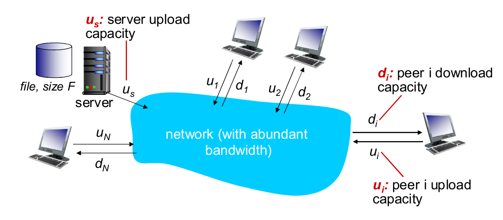
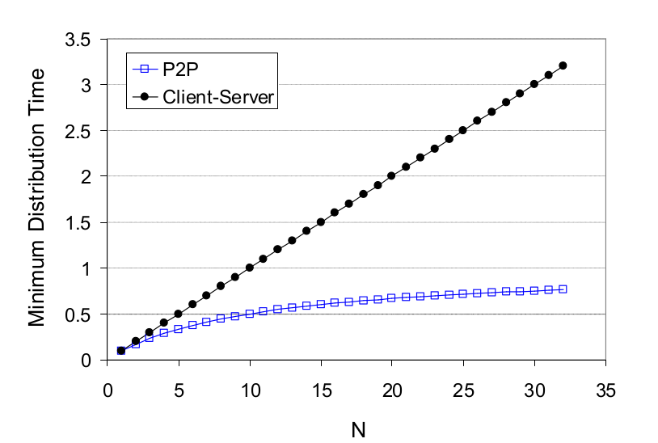
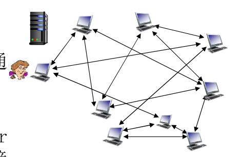
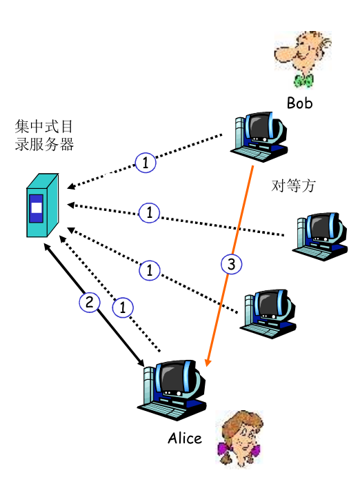
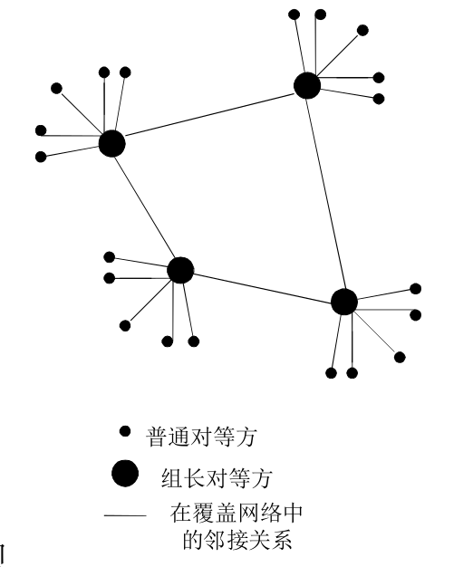

# 2.6 P2P应用

## 纯P2P架构
- 没有/极少一直运行的服务器
- 任意端系统间都可以直接通信
- 利用peer的服务能力
- peer节点间歇上网，每次IP都可能变化

如：文件分发(BitTorrent)，流媒体(KanKan)，VoIP(Skype)

## 文件分发：C/S vs P2P



假设有N个客户端各自想要1份文件，1份文件大小为$$F$$，服务器的上载能力为$$u_s$$，第i个客户端下载能力为$$d_i$$，上载能力$$u_i$$

(通常我们认为客户端的上下载能力很有限，服务器的上载能力很强，但也是有限的)


### C/S耗时

- 服务器将N份文件上载出去的时间最快是$$NF/u_s$$
- 每个客户端下载文件的时间最快是$$F/d_i$$

因此最后一个用户收到文件的耗时是：$$D_{c-s}\geq \max(NF/u_s,F/d_{min})$$

容易发现，随着N不断的增加，下载时间最后将因为服务器带宽瓶颈，线性增加

### P2P耗时

- 服务器至少要上载一份拷贝$$F/u_s$$
- 每个客户端必须下载一个拷贝$$F/d_min$$
- 最大上载带宽是：$$u_s+\sum u_i$$(peer节点也可以上载)
- 通常情况下，用户的下载带宽大于等于上载带宽

耗时：$$D_{p2p}\geq \max \{F/u_s,F/d_{min},NF/(u_s+\sum u_i)\}$$

式子的每一项渐进意义上都是常数

(似乎第三项里**默认上载速度会瞬间达到最大？**那么真的如此吗？)

(这种情形是理想化的，假设用户收到一个bit就能立刻发出一个bit，那么存在一种分发方式可以做到)

(实际上，用户一般需要收到一块内容才可以开始上传(首先你必须要校验内容有没有错，所以不可能收到一个bit就发出去))

(考虑一种**很简陋的朴素方法**，考虑服务器传给1个主机一个块，1个主机传给另一个，然后两个主机传给另外两个，四个主机传给另外四个....)(其实凭感觉就容易得知，**即使是这种垃圾方法，上载速度仍然会以指数的速度很快的达到最大**)




(书上说，P2P的这根函数是**有界的**)(不是很懂)

## BitTorrent



简称BT

- 文件被分块，每块256KB
- peers互相发送接受文件块，相互服务

- Torrent(洪流)，节点的组(互相交换文件块)
- 需要一个tracker服务器

假设Alice想要通过BT下载一个文件
```pseudocode
连接到tracker服务器(BT种子有URL)
tracker回应请求，向Alice提供其他peer节点的IP地址(比如说50个对等方)
Alice向所有这些peer节点创建并行的TCP连接，这就进入了洪流
(随着时间流逝，可能有节点离开，或者有新节点进入)

Alice向他们询问他们都拥有哪些块(周期性)(别人也会问Alice)

while(Alice还没有拥有所有块){
	Alice向peer节点请求一个洪流中最稀有的并且她没有的块
	if(Alice至少有一个块){
		与此同时：将可能有节点向Alice请求块
		Alice按照“谁对她最好”的优先级，挑选前4个请求者并发送文件块(但每过30s，Alice将会随机挑选一次)
	}
}
当Alice拥有了所有的块后，她可能选择离开，或者留在洪流中无私地奉献

```

- 总是请求**最稀有**的块
  - 这对大家好
    - 这可以有效的防止由于一些节点下线，稀有块变得没有节点拥有的情况
    - 其他人下载稀有块的速率也会得到提升
  - 这对个人好
    - 当你拥有了一个稀有块，则更有可能有节点向你作请求，当你给它们发送块以后，他们之后很有可能会**回报你**(发送优先级更高)

- 优先发送“对他最好的”(给他发送最多文件块)请求者，但每30s也会随机的发送一次
  - 利于维护“人人为我，我为人人”的关系
  - 随机发：防止共享圈子收敛，让新人也可以得到一点文件块

(被选择的4个对等方被称为**疏通**)

(新人得到了一些文件块以后就可以向别人服务，从而有机会成为某些节点的前4位提供者)

(BT如今已经发展出了DHT技术，可以在无tracker的情况下下载)

(然而国内的BT环境烂的一批，下啥都下不动)(NAT致使P2P不方便，迅雷吸血，上行带宽窄等等)

### 体验BT

随便下个webtorrent的cli版

webtorrent支持流媒体边下边看


```shell
sudo npm install webtorrent-cli -g
```

下载一个webtorrent的示例视频

```shell
webtorrent download "magnet:?xt=urn:btih:88594aaacbde40ef3e2510c47374ec0aa396c08e&dn=bbb_sunflower_1080p_30fps_normal.mp4&tr=udp%3A%2F%2Ftracker.leechers-paradise.org%3A6969&tr=udp%3A%2F%2Ftracker.coppersurfer.tk%3A6969&tr=udp%3A%2F%2Ftracker.opentrackr.org%3A1337&tr=udp%3A%2F%2Fexplodie.org%3A6969&tr=udp%3A%2F%2Ftracker.empire-js.us%3A1337&tr=wss%3A%2F%2Ftracker.btorrent.xyz&tr=wss%3A%2F%2Ftracker.openwebtorrent.com&ws=http%3A%2F%2Fdistribution.bbb3d.renderfarming.net%2Fvideo%2Fmp4%2Fbbb_sunflower_1080p_30fps_normal.mp4"
```

(我tm，我本来想找个什么好玩的番下，然后所有的这种番都是)

```shell
fetching torrent metadata from 0 peers
```

(我能怎么办，我也很绝望)

## P2P文件共享

### 问题

- 如何定位所需资源
- 如何处理对等方的加入和离开

### 可能方案的形式

- 集中
- 分散
- 半分散

### Napster 集中式



1.peer节点加入时，告知中心服务器它的IP和它所拥有的的内容

2.Alice想要某个文件

3.中心服务器给Alice一张IP列表，Alice从IP列表中请求文件

#### 问题

定位内容高度集中，文件传输是分散的

- 单点故障

  主服务器崩溃，Napster网络崩溃

- 性能瓶颈

  由于Napster仍然需要应对客户端的资源查询，(而且大概每过一段时间要告诉Napster它还在线)，因此当用户数量大量增加时，中心服务器还是开始承受较大的压力

- 侵犯版权

  因此Napster后来被迫关停服务器

你可以发现Napster和早期的BT其实有点相似，但BT是每个文件一个tracker，一个服务器故障不会影响其他文件，并且BT还有一些其他机制等(如果BT没有稀有优先，他很可能不会活到今天)

### Gnutella

- 全分布式，即没有中心服务器
- 这玩意本来是一个软件，之后开源，再后来凉了以后变成了一种协议
- 有许多支持Gnutella的客户端

#### peer节点加入

- Alice必须自己维护一个可用的peer节点列表(经常在线的对等方IP)

  (其实也有通过服务器获取列表的)

```
Alice从对等方列表中试图建立发送TCP连接(通过ping)
当Alice连上一个节点Y后，Y会转发这个ping报文
所有收到ping报文的peer节点以pong报文响应
Alice收到许多Pong报文，于是她能够与他们建立连接
```

- Alice连接到一定数量的节点后，就会停止连接
- 当Alice连上的邻近节点下线后，Alice可能会再次连接其他节点

(你可以发现这些描述很不清晰，Alice会维护多少数量的节点，Alice在连了足够多的节点以后收到ping报文会做什么行为，等等都没有说)

(有的时候自己考虑一下怎么具体的实现协议(甚至可能有几种方法)，而不是一昧地光学，对你有好处)

#### 请求文件

- 在已有的TCP连接上发送查询报文
- 对等方转发查询报文(类似算法里BFS扩散出去那种感觉)
- 如果某台收到查询报文的节点有对应文件，则反向返回查询命中报文

注：如果查询报文一直在网络中不断地转发，会：

- 指数增长的报文数量
- 即使查询者已经获得了目标文件，查询报文可能还在互联网里回荡

因此，查询报文被限制了TTL(最大“跳数”)，一旦TTL降为0，报文就不再转发。(0.4版本的Gnutella中，TTL最大为7)

这种查询方式也被称为**泛洪查询**

#### GnuTella的问题

- 如果你维护的peer节点列表的“死党”全都不在线，你将无法加入Gnutella网络中
- 泛洪查询带来较大的系统开销和带宽开销
- 与整个网络相比，大部分查询因为TTL只能到达很少的一部分节点
  - 经常有用户抱怨：Gnutella网络上什么都下不到

### KaZaA 结构化P2P



- 每个peer节点要么是一个组长，要么隶属于一个组长
  - 子节点与组长有TCP连接
  - 组长间有TCP连接
- 组长跟踪其孩子的内容并代为查询

- 组长与其他组长通过泛洪查询取得数据拷贝

##### KaZaA技巧

- 请求排队
  - 限制并行下载数量
  - 确保每个传输文件都能享有一定带宽(主要是上传的节点)

- 激励优先权
  - 鼓励用户上载文件
  - 加强系统扩展

- 并行下载
  - 从多个对等方下载同一个文件的不同部分

#### KaZaA文件标识

- 文件有：文件元数据，描述，散列标识码(哈希值)

  描述比如说：某某歌手在某某地唱的某某歌(类似文件名)

- 查询匹配：匹配描述，然后返回一个带散列标识码的HTTP请求
- 客户端可以选择要下载的文件

(由于KaZaA使用UUHash(只对文件一部分进行散列)，尽管大文件校验很快，但经常有恶意攻击者据此传播损坏或者伪造的文件)

## DHT

分布式哈希表

(课上也没有说太多，以后补充)
