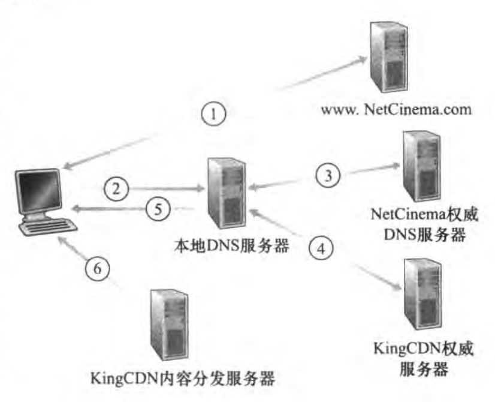

# 2.7 CDN

- 视频流量占据互联网大部分带宽(90%以上)
- **规模性挑战**：单个超级服务器提供视频服务？
  - 可能跨越大洲，瓶颈链路
  - 同一视频可能在同一链路上多次发送，浪费带宽，高昂费用
  - 单点故障
  - 周边网络拥塞

- **异构性挑战**：不同用户能力不同，如带宽不同

解决：分布式应用层基础设施

## 视频

固定速度显示的图像序列

- 高码率：至少十倍于音频
- 可压缩

### 编码

可以利用冗余来降低编码的比特数

- 空间冗余(图像内)
- 时间冗余(相邻图像间)

分类

- CBR(constant bit rate)：固定速率编码

- VBR(variable bit rate)：视频码率随时间变化而变化

  (比如说一种简单的想法是只发送与上一帧不同的像素，而不是全发)

MPEG 1 (CD-ROM) 1.5Mbps

MPEG 2 (DVD) 3-6Mbps

MPEG 4 (often used in internet <1Mbps)

## 多媒体流化服务

DASH：Dynamic Adaptive Streaming over HTTP

服务器：

- 视频文件分割成多个块

- 每个块独立存储，编码于不同码率(如8~10种)

  假设把一个视频切成100段，并且要有8种码率，那么就有800个块

- 告示文件(manifest file)：提供不同块的URL

客户端

```
获取告示文件
while{
	(过段时间就测量服务器到客户端的带宽)
	根据当时可用带宽选择不同的编码块(带宽充足选择最大码率视频块)
	根据所选的编码块，查询告示文件获取URL，通过HTTP头部指定字节范围请求一个块
}
```

客户端自适应决定

- 请求**什么码率**的视频块(如上)
- **什么时候**请求块(不至于缓存挨饿或者溢出(过多))
- 去**哪里**请求块(向离自己近，或者高可用带宽的服务器请求)

## CDN

我们已经知道了，单一的超级服务器是不能胜任向上百万用户同时提供流化视频服务的

因此我们通过CDN(Content Distribution Networks)内容分发网络,全网部署缓存节点，存储服务内容，就近为用户提供服务，提供用户体验

- CDN和web cache有些相似
- CDN可以是专用CDN(内容提供商自己拥有)也可以是第三方CDN
- 部署位置
  - **enter deep** 将CDN服务器深入到许多接入网位置(Akamai)
    - 更接近用户，数量多，离用户近，管理困难
  - **bring home** 通过在少量(如10个)关键位置建造大集群，譬如在IXP位置，或者如一级ISP的POP建造 (Limelight和许多其他CDN公司)
    - 可以租用专用线路将服务器连接起来
    - 较低的维护和管理开销，延时较高，吞吐较低

- CDN不见得把所有视频都存在每个集群，某些视频可能仅在某些国家、地区流行，因此它们采取类似web cache的策略，拉取，在cache中替换不常请求的视频

### CDN操作

#### OTT(over the top)挑战

在拥塞的互联网上复制内容

- 从哪个CDN节点获取内容？
- 用户在网络拥塞时的行为？
- 哪些CDN节点存储什么内容？

#### 访问流程



1.用户访问一个视频网页http://video.netcinema.com/6Y7B23V(别试了，这链接太老了已经寄了)

2.用户发送了一个对于video.netcinema.com的DNS请求

3.该DNS请求被**本地DNS服务器LDNS**中继到一台netcinema的权威DNS服务器，netcinema注意到video，因此向LDNS发送一个KingCDN的专用DNS基础设施的重定向a1105.kingcdn.com

4.KingCDN的专用服务器a1105.kingcdn.com根据**CDN簇选择策略**，返回一个KingCDN节点的IP给LDNS

5.LDNS把该IP发给用户主机

6.客户与该IP创建一个直接的TCP连接，并且通过HTTP GET(如果使用DASH)先请求告示文件，并且自适应的选择不同的块

#### CDN簇选择策略

CDN的专用DNS服务器是知道LDNS服务器的IP地址的，根据这个信息

- 简单的策略是返回**地理上最为邻近**的集群的IP
- **实时测量**时延，丢包等，如通过ping报文或者DNS请求(但LDNS可能不会响应)

## 另外

具体策略可以有所不同

如：

- Netflix使用非高峰时段推高速缓存，而不是cache未命中时拉取
- Netflix不需要DNS重定向，而是直接在客户端里连接一台特定的CDN
- google让客户与集群的RTT尽量低，但有时为了负载均衡会让其重定向到一个更远的

**另外：**

- 看看：混合CDN-P2P流式系统(客户优先使用P2P，流量不足借助CDN)
- P2P也在被融入到CDN的部署管理
- 另外一些游戏下载，如steam，origin也会使用CDN服务，而web cache也在起作用(听说wegame优先P2P下载，所以下得慢，离谱)(存疑)
