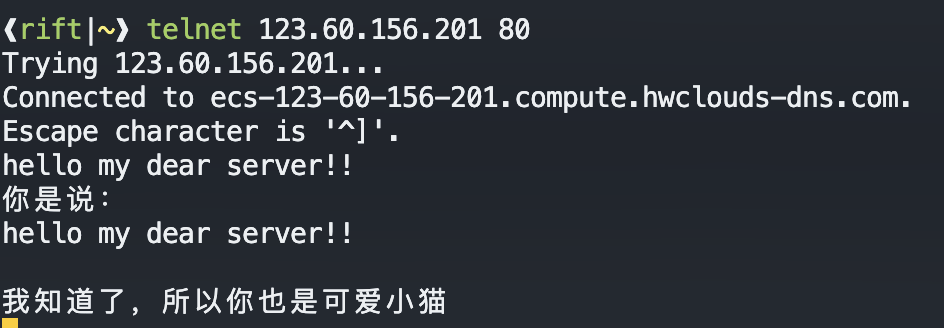

# TCP socket

## 理论简述

- 始终记得一个socket描述符映射的是一个四元组
- 服务器
  - 创建欢迎socket
  - 与本地端口捆绑
  - 开始监听(并且设置buffer大小)，欢迎socket上阻塞式等待连接
  - 连接以后会给一个连接socket(不同与欢迎socket)
  - 既可以单进程处理，优美一点写多进程(如fork)
- 客户端
  - 创建socket(隐式的捆绑到一个本地端口)
  - 指定服务器地址和端口，调用`connect`进行连接

- linux多用`man socket`等等查看手册(windows有在线的官方手册)

## 交互过程图

(很显然)


## 代码


一个客户端简单TCP socket


```c
//通过TCP socket向www.bing.com发送一个HTML GET报文

#include <unistd.h>
#include <stdio.h>
#include <sys/socket.h>
#include <sys/types.h>
#include <arpa/inet.h>
#include <string.h>
#include <stdlib.h>
#include <netdb.h>
int main(int argc,char *argv[]){
	struct sockaddr_in sad;
	int sockfd;//socket 文件描述符(如果你不知道什么是文件描述符，你应该复习操作系统)
	char send[]="GET / HTTP/1.1\nHost: www.bing.com\nAccept: */*\n\n";//要发送的报文
	char recieve[256];//接收的报文
	char* host="www.bing.com";//主机名
	int	port=80;//端口
	sockfd=socket(PF_INET,SOCK_STREAM,0);//ipv4,流式传输(具体看man socket)
	memset((char *)&sad,0,sizeof(sad));//初始化
	sad.sin_family=AF_INET;//协议族为ipv4
	sad.sin_port=htons((u_short)port);
	struct hostent* ip=gethostbyname(host);	
	memcpy(&sad.sin_addr,ip->h_addr,ip->h_length);
	if(connect(sockfd,(struct sockaddr *)&sad, sizeof(sad))==0)//连接
		printf("connect success\\n\n");
	else
		printf("connect failed\n");
	int n=write(sockfd,send,sizeof(send));
	printf("send %d Byte:\n%s\n\n",n,send);
	
	n=read(sockfd,recieve,sizeof(recieve));
	printf("recieve from server:\n%s\n",recieve);
	close(sockfd);
	return 0;
}
```


一个服务器简单TCP socket


效果：telnet随便给它发点东西，它会：



```c
#include <netinet/in.h>
#include <unistd.h>
#include <stdio.h>
#include <sys/socket.h>
#include <sys/types.h>
#include <arpa/inet.h>
#include <string.h>
#include <stdlib.h>
#include <netdb.h>
#include <sys/types.h>
int main(){
	int daemonfd,connectfd;//守候进程socket文件描述符，连接进程socket文件描述符
	struct hostent *ip;
	struct sockaddr_in sad,cad;
	int port=80;
	int recieve_length;
	char recieve[4096];
	daemonfd=socket(PF_INET,SOCK_STREAM,0);
	memset((char *)&sad,0,sizeof(sad));
	sad.sin_family=AF_INET;
	sad.sin_addr.s_addr=INADDR_ANY;
	sad.sin_port=htons((u_short)port);

	bind(daemonfd,(struct sockaddr*)&sad,sizeof(sad));
	listen(daemonfd,5);
	while(connectfd=accept(daemonfd,(struct sockaddr *)&cad ,&recieve_length)){
		//accept会一直阻塞，直到它连上一个连接
		int pid=fork();//如果你不知道什么是fork，请自行查阅
		if(pid!=0)continue;//父进程继续accept等待
		int n=read(connectfd,recieve,sizeof(recieve));
		write(connectfd,"你是说：\n",strlen("你是说：\n")+1);
		write(connectfd,recieve,strlen(recieve)+1);
		write(connectfd,"\n我知道了，所以你也是可爱小猫\n",strlen("\n我知道了，所以你也是可爱小猫\n")+1);
		close(connectfd);
		exit(0);//子进程退出
	}
	return 0;

}
```


