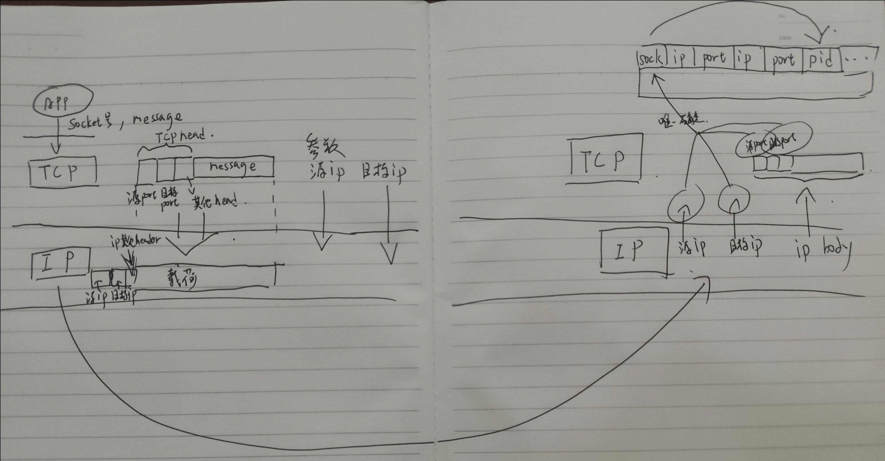

# 多路复用与解复用

多路复用与解复用就是传输层如何把主机到主机的服务升级为进程到进程

## TCP

- 下面说的socket号，也是文件描述符$$socket号\subsetneq 文件描述符$$

- 考虑一个由socket号为索引的一个“数组”，数组包含四元组(源ip，源端口，目标ip，目标端口)，还有pid(该socket对应的进程号)，(可能还有一些其他的信息)，socket号 与 四元组 **一一对应**。一个pid可以对应多个socket号，一个socket号也可以对应多个pid

  (如果不考虑多进程/多线程技术(比如不许用fork等)，那么一个socket号只可以对应一个pid，但一个pid可以对应多个socket)

- 如果你对COW fork里需要用页表引用计数十分熟悉的话，你也能明白，fork时，socket引用计数也+1了，只有所有的进程都close了这个socket，才会真正的关闭

- 如图，总的来说，就是socket号与四元组互相唯一的确定的过程

## UDP

- 过程与TCP类似，只是UDP维护二元组，因此`sendto`和`recvfrom`时还需要指定/提取目标ip和端口，其他差不多
- 因为UDP是二元组，所以：不同的源ip不同的源端口相同的目标ip相同的目标端口 会 发到同一个socket号上，(不考虑多进程/线程时，也即是会发到同一个程序上)

## 另外

- TCP端口和UDP端口是各自独立的
