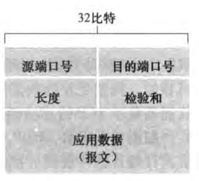

# 无连接传输 UDP

## 特点及优势

(老生常谈)

- 尽力而为的服务

- 无连接(不需要维护连接状态，因此服务器可能可以服务更多的用户)

- 无须建立连接(变慢)

- 何时发送更为精细(TCP可能因为拥塞控制而变慢)

- 更小的分组头部(UDP 8 Byte,TCP 20 Byte)

(另外还有google的QUIC也是基于UDP的)(QUIC在应用层保证数据可靠性)

## 应用

- DNS

- SNMP(网络层会讲)

## 报文段结构

UDP首部每个字段都是2 Byte，共8 Byte

## UDP检验和

将报文段内容看作16bit的整数

两个16bit的数字相加时，如果发生溢出，则要**回卷**，即在个位上+1，如：

1011101110110101

+

1000111100001100

=

0100101011000010

将所有数求和后，对和求反，即得到检验和

接收方，将所有数求和，并加上检验和应该得到111111111111111，如果其中有零，则得知报文有误
