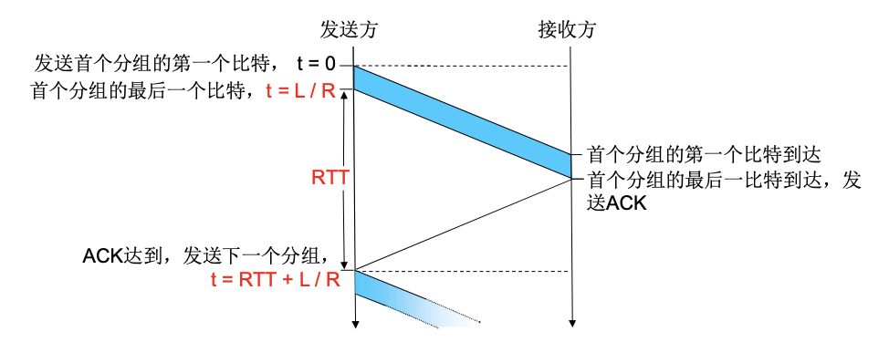

# 可靠数据传输原理

rdt非常重要

(这节没有想象的难)

(这节看课会觉得很容易，看书容易瘟住)

(由于内容实在太多，而且并不是很难，眼下我只会粗略的在这个笔记里写两笔)

(再次重申，我的笔记都是写给已经看过课/书的读者的，请不要第一遍就看笔记)

**仍有的困惑**

- 似乎可靠数据传输并不是**万无一失**的？
  如果有效载荷某些bit翻转了，而恰好checksum中也翻转了一些bit，checksum翻转后还恰好对应上了错误的有效载荷，那岂不是差错不会被检查出

  (尽管直觉上，这种情况的发生应该非常罕见)

  (我没有学过信息论，随便查了一点，似乎信息传输速率超过信道容量后，不可能实现无差错的传输可靠性)(学识浅薄，可能与这无关)

## rdt1.0

下层信道完全可靠的情况下(不错不丢)，直接发直接收即可

## rdt2.0(有缺陷)

考虑下层信道可能有bit翻转但不会丢(错，但不丢)

- 增加一个checksum用于检验是否有bit翻转

- 接收方使用ACK/NAK来表示，收到了正确的分组或者错误的

- 收到NAK重发，收到ACK发下一个

## rdt2.1

2.0中ACK和NAK也可能有bit翻转

- 为ACK/NAK增加checksum

- 如果发送方收到NAK或者校验出错的ACK/NAK，一律重发分组

  - 其实发的是ACK，造成重复，问题不大，接收方再发一次ACK

  - 发的确实是NAK，收到重发的分组，合理

- 接收方不能知道发送方有没有正确的收到ACK/NAK

- 由于接收方可能收到重复分组，不编号，接收方无法确定是新分组还是老分组重发

  - 因此，可以使用0表示第偶数个分组，1表示第奇数个分组

(请注意，只有确认，没有什么确认的确认之类的机制，即发送方永远不会发ACK/NAK)

## rdt2.2

不再使用NAK，而是：

- ACK必须包含编号，即ACK0，ACK1

- 接收方永远对**最后正确接收的分组发ACK**

  - 如0号包之前成功接收，此时1号包校验错误，rdt2.1发NAK，而rdt2.2发ACK0

(这是在为之后的流水线发送做准备)

## rdt3.0

又称**停等协议**

下层信道既可能bit翻转也可能丢失分组

- 引入超时重传(收到不正确序号的ACK，校验错误的ACK，没收到ACK并且超时，都会重发)

  - 设置合理的超时时间很重要(一般比一次RTT稍微长一点)

  - 过早的超时也能正常工作，但效率较低，可能一半以上的分组和确认都是重复的

很显然rdt3.0会等待上一个分组已经被正确接收才会发下一个，因此也叫停等协议

**(rdt3.0已经能够保证可靠数据传输了，但很多时候效率低下)**

($$U_{sender}=\frac{L/R}{RTT+L/R}$$,其中L是分组长度，R是传输速率，即$$L/R$$是发出一个分组的速度)

例：$$R=1Gbps,L=1KB,RTT=15ms$$时,$$U_{sender}=0.00027$$，一个1Gbps的链路只用了，33.75KB/s的速率

瓶颈：网络协议限制物理资源利用

## 流水线协议

发送方在未得到对方确认的情况下一次发送多个分组

- 必须增加序号范围，使用多个bit来表示分组序号

- 发送方/接收方要有缓冲区(buffer)
  - 发送方可能需要重传

  - 接收方可能收到乱序的数据，需要重排

发送方缓冲区=1：停等协议

发送方缓冲区>1：接收方缓冲区=1：Go-Back-N协议，>1：selective repeat协议

### 滑动窗口协议

#### 发送窗口

考虑一个数组表示的队列，用后沿(或者考虑为left指针)和前沿(或考虑为right指针)之中的范围，来表示发送窗口

- 发送窗口大小不能超过发送缓冲区

- 初始化：后沿=前沿

- 每发送一个分组，前沿向前移动(不能使发送窗口大小大于缓冲区)

- 当且仅当后沿所指向的这个分组收到了对应的ACK，后沿向前移动一格

例如：后沿指向0，前沿指向5，即使1～4的ACK都收到了，后沿也不能动。只有再等ACK0收到以后，才可以把后沿移到5

(很显然我们需要一个额外的数据结构来记录窗口中哪些分组已经收到了ACK)

#### 接收窗口

当接收窗口=1时，只允许顺序接收，>1时，可以乱序

- 接收方只会接收分组序号落入接收窗口里的分组，其他会被丢弃

- 类似的，当且仅当后沿所指向的分组正确的接收，接收者向上层的流递交数据，后沿向前移动

- 大于后沿所指向的序号(但在窗口之内的)会被缓存，但暂时不交付

#### 异常现象

- GBN只有一个定时器：超时重发会重发所有在发送窗口的分组

- SR对每个未确认分组都有一个定时器。

#### ACK

- GBN只发送顺序正确接收的最高序号的分组对应的ACK

- SR对于每个正确接收的分组，分别发送对应编号的ACK

### 对比GBN和SR

- GBN 实现简单，接收方只需一个缓存单元
  一旦出错，回退N步代价高

- SR 出错重传一个代价小

  复杂，所需资源多(接收方多个缓存单元)

出错率非常罕见适合GBN

链路容量大(延迟大，带宽大)适合SR

假如以n个bit编码序号

则窗口的最大尺寸

- GBN:$$2^n-1$$

- SR:$$2^{n-1}$$
