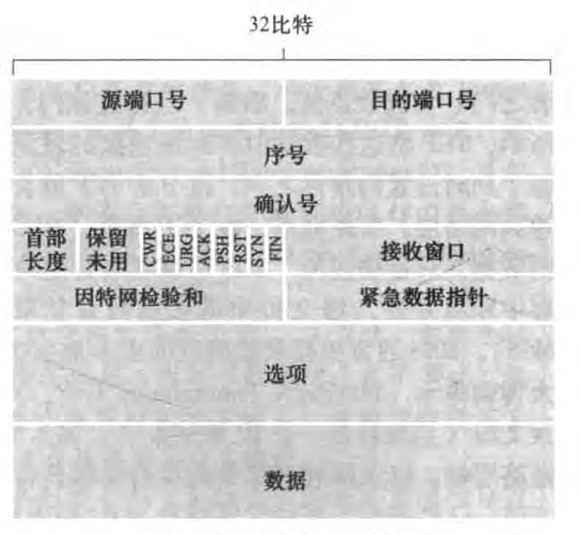
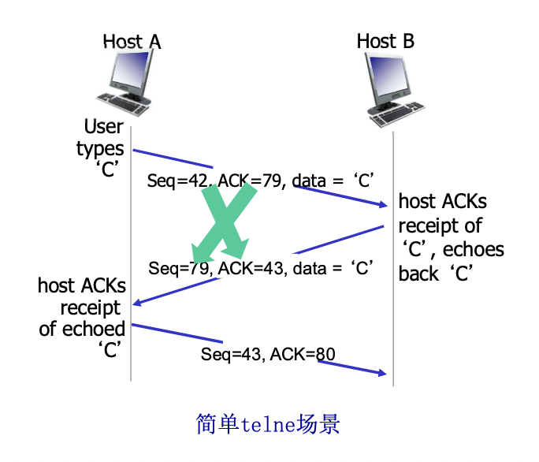
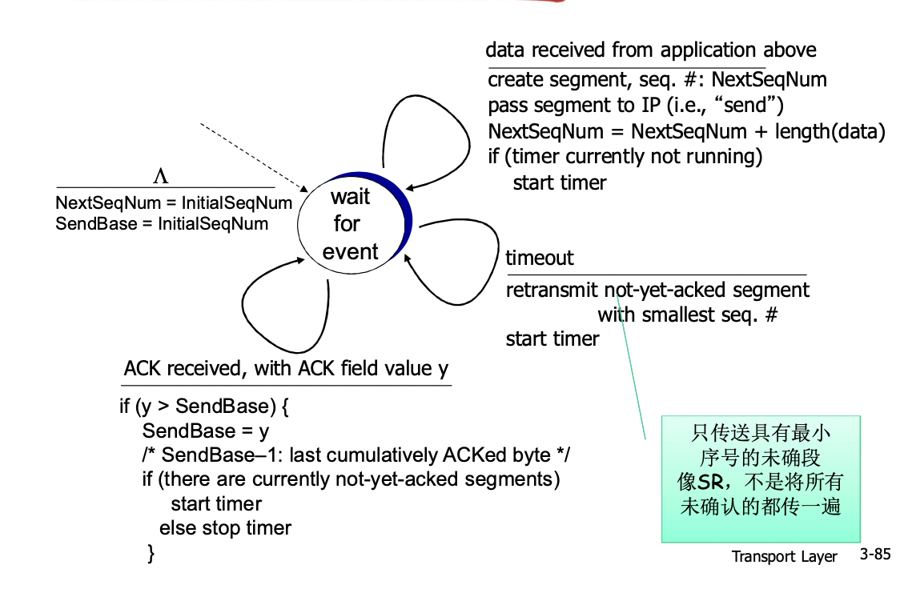
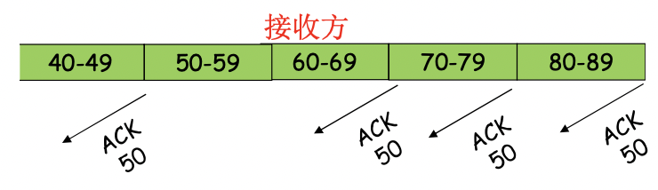
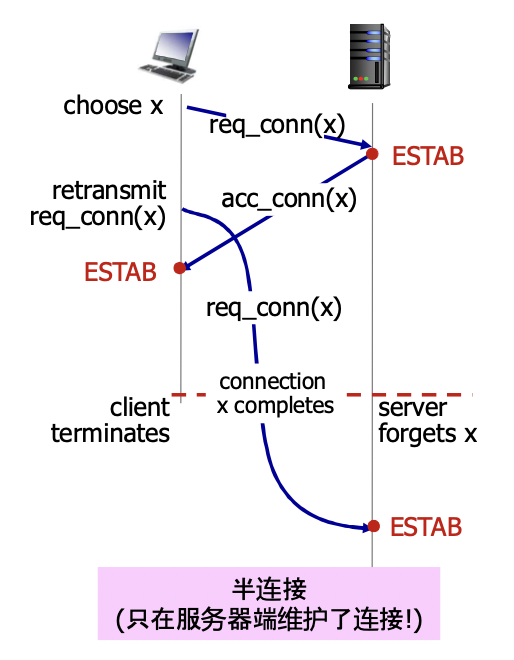
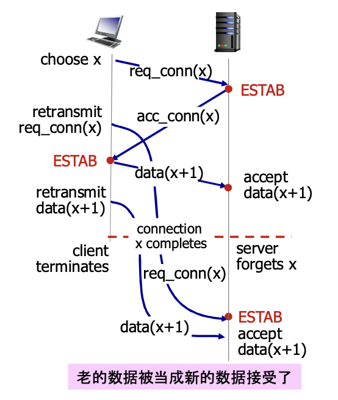
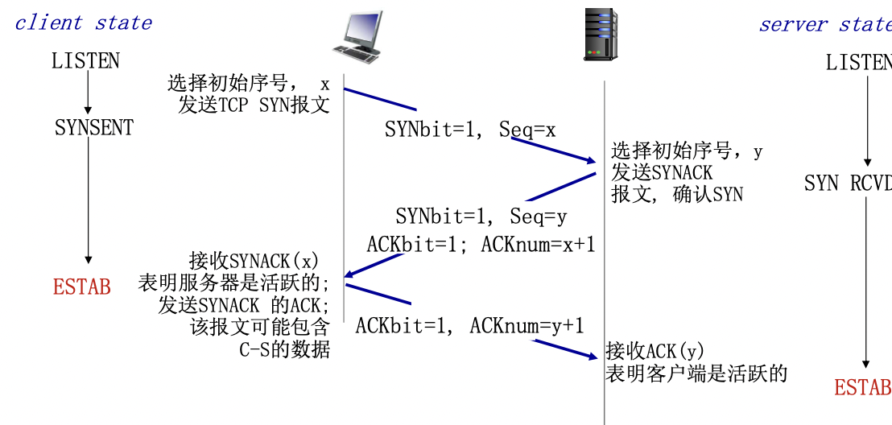
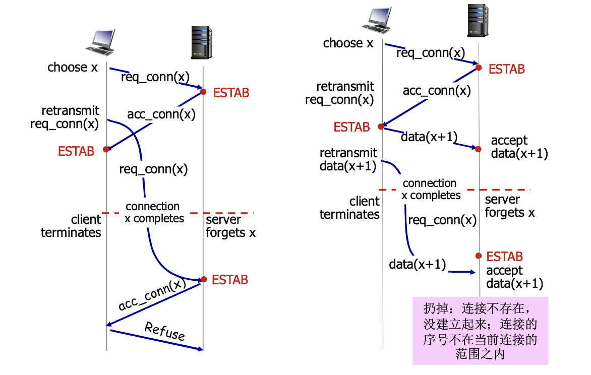
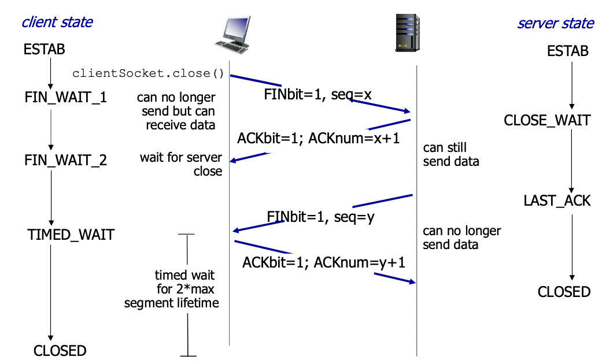

# 面向连接传输 TCP

## 概述

- 点对点
  一个发送方，一个接收方

- 可靠，按序的字节流
  没有报文边界

- 管道化(流水线)
  TCP拥塞控制，流量控制设置窗口大小

- 发送，接收缓存

- 全双工数据
  同一连接数据流可双向流动
  - MSS：最大报文段大小(TCP报文段载荷+TCP头部+IP头部恰好等于链路层一帧大小的最大值(又称MTU))(由MTU计算MSS)

- 面向连接
  交换数据前，通过握手初始化发送方接收方状态变量

- 流量控制
  发送方不会淹没接收方

## TCP报文段结构

- 源端口，目标端口，checksum和udp里的一样

- 序号(sequence number field) 确认号(ack号)：后面说

- 接收窗口：用于流量控制

- 首部长度字段：TCP首部是可变的长度(典型选项字段为空，长度20字节)

- 选项字段：协商MSS长度，时间戳，或在高速网络环境下作窗口调节因子(不懂)

- 标志字段

 - ACK位：指示ACK字段有效
 - RST，SYN，FIN用于连接建立和拆除，待会说
 - PSH马上推出数据(通常不用)
 - CWR和ECE用于拥塞控制，下两节说

## TCP序号确认号

- 序号：初始序号+报文段首字节在字节流中的编号

- ACK号：期望从发送方收到下一个字节的序号
  (就是说如果ACK51，则代表0～50我都收到了我想要51以及以后的)
  - 累计确认(按照顺序正确到来的最后一个段发对应ACK)

接收方如何处理乱序报文段(缓存或丢弃)：没有规定

注：初始序号在绝大多数情况下都不会是0

注：(如果接收方也要给发送方发报文，即接收方也是发送方)很显然ACK可以被**捎带**在一个发送报文中

### 例

## RTT和超时时间

- 超时时间应该长于RTT，但RTT是变化的

- 太短：太早超时，不必要的重传

- 太长：对报文段丢失反应太慢，消极

### 设置超时时间

#### 估算RTT

SampleRTT：最近一次报文段发出到收到确认的时间

$$EstimatedRTT=(1-\alpha)*EstimatedRTT+\alpha*SampleRTT$$

(可以把它考虑成平均数，但不完全是)

- 指数加权移动平均

- 过去样本的影响以指数衰减

- 推荐值：$$\alpha = 0.125$$

#### 估算安全边界时间

(可以把它考虑成标准差，但不完全是)

$$DevRTT = (1-\Beta)*DevRTT+\Beta*\abs {SampleRTT-EstimatedRTT}$$

- 推荐值：$$\Beta=0.25$$

超时时间间隔设置为：

$$TimeoutInterval=EstimatedRTT+4*DevRTT$$

(想想正态分布3sigam原则，这里类似的)

## TCP 可靠数据传输

TCP是滑动窗口，但它既不是GBN也不是SR，介于之间

- 在IP的不可靠服务基础上建立rdt

 - 管道化报文段
 - 累计确认
 - 单个重传定时器，**重传只传最早的一个未确认段**
 - 是否接收乱序，没有规范

### 以下事件触发重传

- 超时

- 多余的3个确认(又叫快速重传)

也就是说收到一个ACK51后又收到3个ACK51

(这代表什么？比如30～50到了，可能后面70～90到来，90～110到了，110～130到了，50～70都还没到)

## TCP(简化版)

首先忽略快速重传，流量控制和拥塞控制

### 事件

- 接收上层传下来的数据

  1. 用nextseq为首字节编号创建报文段

  2. 递交给IP层

  3. 如果没有启动定时器，那么启动(注意定时器总是关连最早的未确认的报文段)

- 超时

  1. 重传最早的未确认的报文段(即后沿所指向的报文段)
  2. 重启定时器

- 收到ACK

  1. 如果ACK序号所代表的段比后沿靠右，右移后沿

  2. 如果当前还有未确认的段(也就是后沿没有紧贴前沿)，重启定时器

### 产生TCP ACK的建议(优化)

| 接收方的事件                                                 | TCP接收方动作                                                |
| ------------------------------------------------------------ | ------------------------------------------------------------ |
| 所期望序号的报文段按序到达。 所有在期望序号之前的数据都已经被确认 | 延迟的ACK。对另一个按序报文段的到达最 多等待500ms。如果下一个报文段在这个时 间间隔内没有到达，则发送一个ACK。 |
| 有期望序号的报文段到达。  另一个按序报文段等待发送ACK     | 立即发送单个累积ACK，以确认两个按序报 文段。                 |
| 比期望序号大的报文段乱序到达。 检测出数据流中的间隔      | 立即发送重复的ACK，指明下一个期待字节 的序号                 |
| 能部分或完全填充接收数据间隔 的报文段到达。              | 若该报文段起始于间隔(gap)的低端， 则立即发送ACK              |

第一第二行的解释：如果有两个按序的报文段连续抵达，那么可以只发后一个报文段的ACK这样可以节省一些ACK。但两个一定要发一个，而不能说等到第三个再发，而且第一个和第二个之间的间隔时间也有限制(防止发送方没收到第一个的ACK而重发，造成浪费)

### 快速重传

- 超时周期往往可能太长

- 如果说后面三个段都到了，这个段还没到，那么很有可能这个段丢了

## 流量控制

防止发送方淹没接收方

接收方在头部的接收窗口(rwnd)字段，指示自己还有多少的缓存空间。

$$rwnd=RcvBuffer-(LastByteRcvd-LastByteRead)$$

这样发送方就不会发超出缓存空间的数据

保证$$LastByteSent-LastByteAcked\leq rwnd$$

(为了防止rwnd=0阻塞发送方发送，收到rwnd=0时，发送方还会发送一个长度为1字节的报文段，接收方在最终清空一部分缓存后，给发送方发一个非0的rwnd的ACK)

## TCP3次握手

### 为什么不能2次握手，为什么要有初始序号，而且不能为0？

- 2次握手，重传导致服务器维护了半连接

- 不使用不同的初始序号，导致旧的数据在网络中滞留以后被当作新连接的新数据

解决：3次握手+变化的初始序号

## TCP关闭连接

TCP关闭连接是分别关闭两个半连接，关了半个就表示一方不会继续发数据了

发送FIN bit=1的TCP段

收到TCP发ACK，ACK也可以同自己的FIN=1发出去

图为4次，实际上可以三次

### 为什么不能同时关闭？

考虑A和B说，我们8点关闭连接。

但A不能保证B收到，因此，B也要发回来"我知道8点关了"。

然而两次也不行。因为B不知道他这条消息能不能传给A，因此要第3次

所以A还要发"我知道你知道8点关了"，然而A也不能确定B收到了，因此要4次

......永无止境

原因就在于，为了保证第n次的通讯有效，必须有第n+1次通讯，然而第n+1次通讯的保证，需要第n+2次。因此同步关闭是不可能实现的

