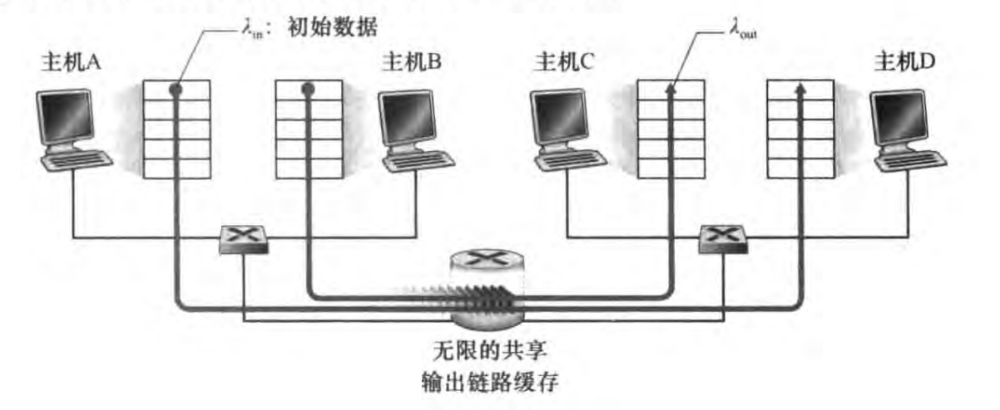
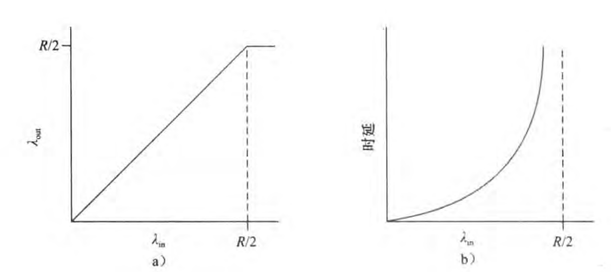
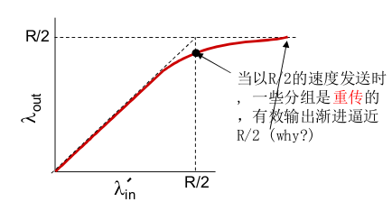
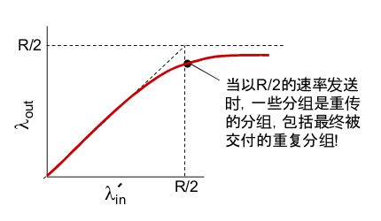
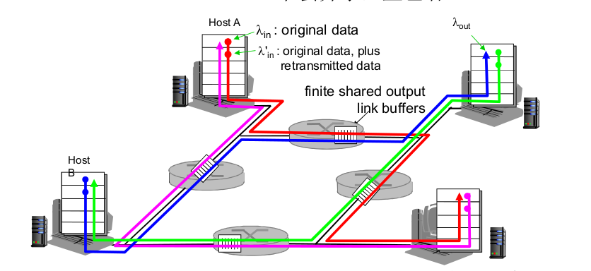
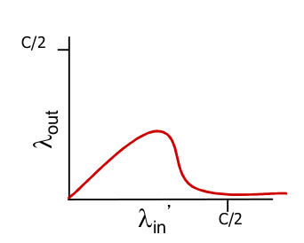

# 3.6 拥塞控制原理

非正式定义：太多的数据需要网络传输，超过了网络的处理能力

拥塞的表现：

- 分组丢失(路由器缓冲区溢出)

- 分组经历较长时间的延迟(路由器队列中排队)

(网络中前十位的问题)

## 拥塞的原因和代价

### 场景1：两个发送方和一台具有无穷大缓存的路由器

设主机向路由器提供数据的速率是$$\lambda_in$$

设接收方收到数据的速率为$$\lambda_out$$

显然，当两个发送方的发送速率达到链路的一半时，链路已经被充分利用了，不可能有更大的“泵出”

在1.6节，我们学习过流量强度与时延的关系，当$$\lambda_in$$达到$$R/2$$时，流量强度接近1时，排队时延陡增，=1时，排队时延无穷大

- 吞吐量理想

- 时延，非常不理想

### 场景2：两个发送方和一台有限缓存路由器

设应用程序向socket的提供速率是$$\lambda_in$$

设socket向网络发送报文段的速率是$$\lambda_in'$$(因此不但含初始数据，还有重传数据)，有时称作“供给载荷”

(显然：$$\lambda_in' \geq \lambda_in$$)

设接收方收到数据(应用层)的速率为$$\lambda_out$$

#### 理想化：发送端(不可思议地)确定路由器是否有空闲缓存

- 只在缓存可用时发送，不会丢包

- $$\lambda_in' = \lambda_in = \lambda_out$$

- 此时吞吐量性能理想

#### 理想化：掌握丢失信息

- 发送端得知分组被丢后，重传分组

#### 现实：重复

- 丢失的分组，以及超时但其实没有丢失的分组都重传了

拥塞代价

- 为了达到一个有效输出，网络需要更多工作(重传)

- 没必要的重传，链路层包含了多个分组的拷贝(降低了"goodput")

### 情况3：4个发送方和具有有限缓存的多台路由器及多跳路径

记最上的路由器为R1，逆时针的标记其他路由器为R2，R3，R4

- 当$$\lambda_in'$$较小时，很少有分组丢，显然$$\lambda_out$$也增加

- 当$$\lambda_in'$$增加时($$\lambda_in'$$超过路由器转发速度)，所有路由器的缓存都满了，某个时间路由器要么剩一个缓存单元要么不剩，考虑R1的情况，由于红线是主机发送速率，蓝线是路由器发送速率，蓝线将很难竞争的过红线($$\lambda_in'$$越大，情况越严重，趋于无穷时，蓝线必然竞争不过红线)，因此蓝线的分组很难传到目标主机。在R2时，红线成为了所谓的“蓝线”，其他同理。所有的主机都在努力发送分组，但很少有分组跨越第二跳真正地抵达了目标主机

- 可怕的是，当$$\lambda_in'$$超过某个临界值时，由于分组丢失，主机为了维持$$\lambda_out$$不变，则需要上调$$\lambda_in'$$(因为有些分组需要重发)，而上调后，会导致网络更加拥塞，分组丢失情况更加糟糕，(如果你还记得生物：这如同是一个正反馈调节)。也就是说，当$$\lambda_in'$$超过某个临界值后，最后$$\lambda_in'$$会趋于无穷大，而$$\lambda_out$$反而越来越低

又一个拥塞代价：任何“关于这个分组的上游传输能力”都被浪费了

## 拥塞控制方法

- 端到端拥塞控制(TCP)
  - 没有来自网络的显示反馈
  - 端系统根据延迟和丢失推断是否有拥塞
- 网络辅助的拥塞控制
  - 路由器提供给端系统反馈信息
    - 单个bit置位，显示有拥塞
    - 显示提供发送端可采用的速率

(TCP/IP也可以选择性地实现网络辅助拥塞控制)

### 案例：ATM ABR

- 链路“轻载”：发送方使用可用带宽

- 路径拥塞：发送方限制发送速率到一个最小保障

RM信源(类似分组，但长度比分组小很多)

- 发送端发送，交换机可以设置当中的bit
  - NI bit：(轻微拥塞)速率不要再增加了
  - CI bit：拥塞指示
- 设置RM信元的2字节ER字段(显示的告诉你最高多少速率)
  - 拥塞的交换机可能降低信元中ER的值
- EFCI bit：拥塞的交换机置1，接收端在返回的信元中设置CI bit(也就说告诉发送者减小速率)

(TCP拥塞控制在下一节)

