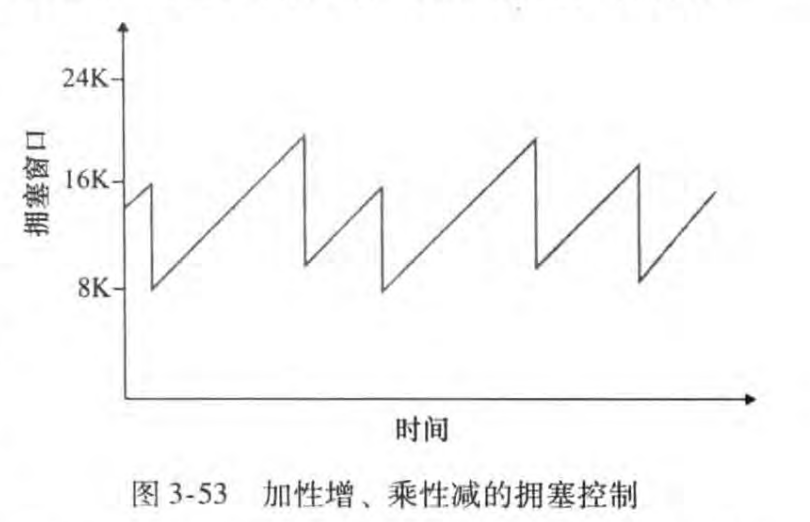
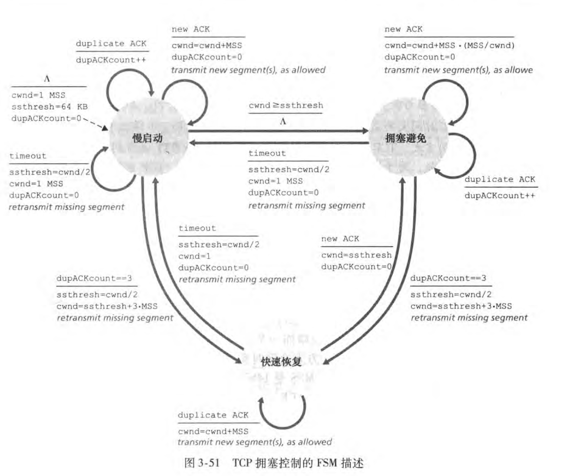
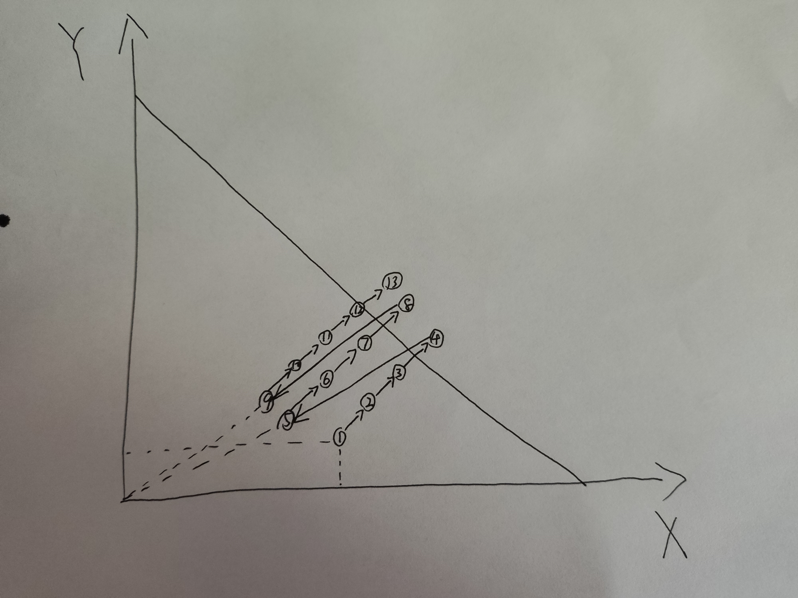

# 3.7 TCP拥塞控制

- 端到端拥塞控制
  - 路由器负担轻
  - 保持网络核心简单

## 拥塞控制的问题

- 如何检测轻微拥塞/拥塞？
- 面对轻微拥塞/拥塞时如何降低速率
- 拥塞缓解时如何增加速率

## 拥塞感知

- 某个段超时：判定为拥塞
  - 原因：大概率网络拥塞丢包，小概率bit翻转，出错被丢弃
  - 大概率正确控制，小概率误判
- 3次冗余ACK：判定为轻微拥塞
  - 3次冗余ACK意味着什么不用多说了吧？
  - 拥塞但比第一种情况好

## 速率控制方法

维护一个新的拥塞窗口(congestion window)，拥塞窗口大小表示为cwnd，接收窗口大小表示为rwnd，则有发送方未被确认的数据量有：

  $$LastByteSent - LastByteAcked \leq min(cwnd,rwnd)$$

由于接收窗口通常比拥塞窗口大得多，因此可以看作是由拥塞窗口决定

因此可以非常粗略的给出一个发送速率的计算式：

$$rate \approx \frac{cwnd}{RTT} bytes/sec$$

尽管这个式子相当的粗略，但我们能知道：通过减小拥塞窗口可以减小发送速率

## TCP拥塞控制算法:AIMD

慢启动(slow-start)，拥塞避免(congestion-avoidance)

然而，慢启动的速率增长是指数的，ca的速率增长是线性的

(慢启动慢个锤子)

### 慢启动(SS)

- 连接建立时，cwnd=1 MSS
  如 : MSS = 1460bytes & RTT = 200 msec 初始速率 = 58.4kbps
- 一般来说可用带宽 远大于 此时的速率(因此应该尽快加速)
- 连接开始时，指数的增长发送速率，直到发生丢失
  - 每一个RTT，cwnd翻倍
  - 实现上：每收到一个ACK，cwnd加1
  - 直到超时或者3个冗余ACK
- 慢启动的持续时间很短

### 拥塞事件
维护一个ssthresh，阈值变量

```pseudocode
//拥塞事件：超时或3个冗余ACK发生
ssthresh=cwnd/2;
if 是超时{
	cwnd=1 MSS;
	进入慢启动阶段 until (cwnd达到ssthresh或者发生拥塞事件);
	if 发生的是拥塞事件
		goto 第一行
}
else{//3个冗余ACK
	cwnd=cwnd/2;//此处又叫快速恢复，因为相比超时，没有慢启动阶段
}
//运行到这里说明cwnd达到了ssthresh，且没有发生拥塞事件
进入拥塞避免阶段
```
### 拥塞避免(CA)

- 线性增加速率
  直到出现拥塞事件

## TCP拥塞控制机制：总结

- 乘性减，加性增

- 由于慢启动所占用的时间非常少，于是常常可以忽略，则有速率图像：



### 算法总结

- 无论何时，只要发生拥塞事件就进入控制阶段，下调/重设阈值和速率
- cwnd < ssthresh 慢启动，指数增长
- cwnd > ssthresh 拥塞避免，线性增长



## TCP吞吐量

设window尺寸W，往返时长RTT，并且它们在长时间的TCP下基本不变，考虑长时间的TCP平均吞吐量

$$avg TCP throughput=\frac{3}{4}\frac{W}{RTT}\ bytes/sec $$

(慢启动忽略不计，实际上发送速率就一直是w/2线性到w，掉到w/2，再线性到w)

## TCP公平性

- 如果K个TCP会话分享一个链路带宽为R的瓶颈链路，每个有效会话的带宽为$$R/K$$

### 例：简单的2个竞争的TCP会话会收敛到每个会话各一半



X：会话1发送速率

Y：会话2发送速率

R：链路带宽

图中直线为$$X+Y=R$$

- 图中忽略了慢启动过程
- 这个不太严谨，其中有一些细微的疏漏，仅作为一种直观
- X+Y可以短暂的超过R，因为路由器有缓存
- 当X+Y超过R持续一段时间就会出现拥塞，此时速率掉为一半(当前的点与原点连线的中点即为下一个点)
- 图中的1，2，3...为时间顺序
- CA阶段X和Y同时同速度地增加，因此CA阶段连线垂直与$$X+Y=R$$
- 可以直观感受到，最后X和Y的速率收敛于各自$$R/2$$

### 并不是完全公平

- UDP没有拥塞控制，UDP可能压制TCP的发送
- 两个端节点的TCP连接可以有多个并行连接(而另外一对可能只有一个连接)

(因为拥塞控制的存在，许多流媒体应用倾向于不用TCP)

## 网络辅助拥塞控制

1980年代开始，拥塞控制逐渐标准化...

路由器在持续发生拥塞时，在ip头部的两个bit指示是否拥塞，接收方收到带拥塞的报文后，在ACK时的TCP报文头部设置ECE，指示明确拥塞通告回显
