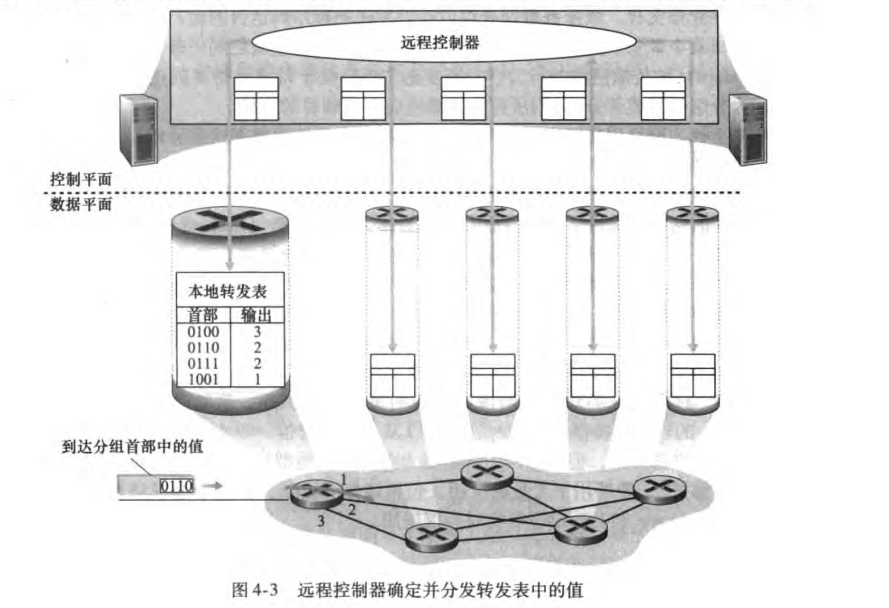
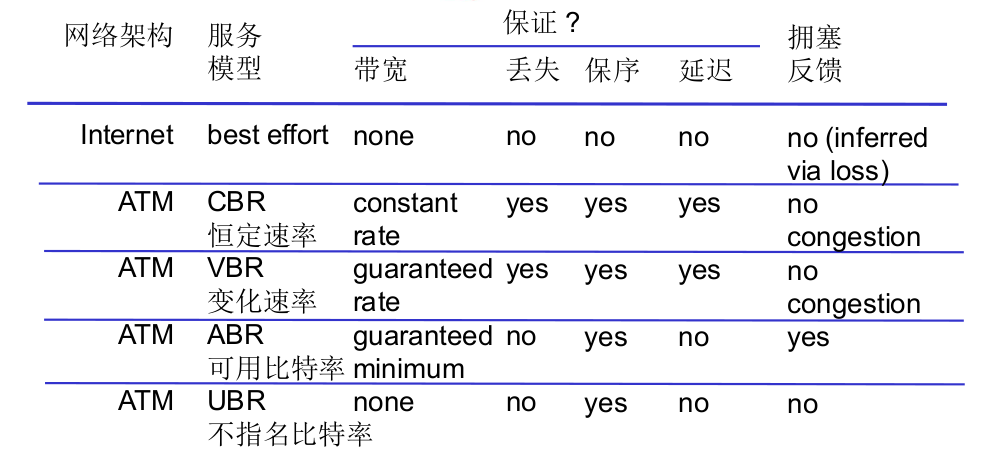

# 4.1 导论

## 网络层服务
- 数据报/分组
- 网络层协议存在于每个主机和路由器
- 路由器检查每个经过它的IP数据报头部

## 网络层功能

- 转发(forward)(数据平面)：指将分组从一个输入接口转移到适当的链路接口的路由器本地动作
- 路由(route)(控制平面)：确定分组从源到目的地所采取的端到端路径的网络范围处理过程
  - 传统路由算法：分布式地维护一个**转发表**，根据首部值索引转发表，指明输出接口
  - SDN(software-defined networking)：远程控制器计算和分发转发表以供每台路由器使用(集中式的)(利于修改)
    - 不同与传统方式，SDN可以做很多事：
	  - 转发
	  - 负载均衡或是泛洪
	  - 重写首部值(比如用于NAT)
	  - 阻挡(比如有坏逼伪装另外一个源IP地址以达到某种攻击)

SDN：

## 网络服务模型
Internet只是尽力而为的服务模型(换言之，啥保证也没有)

但其他网络，如ATM，则有一些保障

## 另

请注意(尽管我已经在导论里提过)：分组交换机包含路由器和链路层交换机

(这么奇怪的设定得怪取名的)

(但如果只说交换机且没有上下文，那一般指的是链路层交换机)
