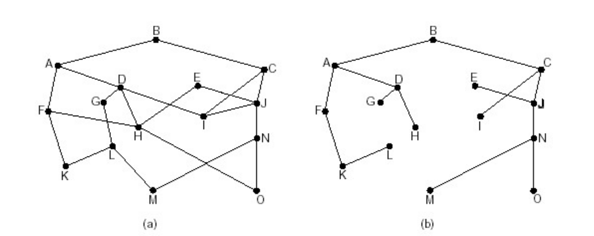
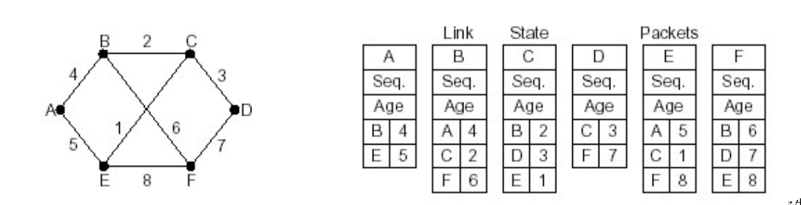

# 5.2 路由选择算法

(考试周，笔记粗糙)

路由：按照某种指标 ( 传输延迟 , 所经过的站点数目等 ) 找到一条从源节点到目标节点的较好路径
- 较好：为什么不是最好，最好的代价太大
- 指标：跳数，延迟，队列长度等。。或几种指标混合

以**网络**(子网)为单位进行路由，而不是以单个主机/路由器作为单位，因此后面说的节点指的是路由器和其下的子网。
- 前提：一个网络的所有IP应该有一个相同的前缀，而且应该在物理上聚集

(注意：主机到路由器通信由链路层解决)

## 数学模型

很显然可以由图来描述网络，设$$G=(N,E)$$，即N个节点，E条边构成的集合。

边权即节点x和y间的开销，(如延迟)，记作$$c(x,y)$$

考虑的是**无向图**

### 汇集树

考虑一张图中，取某一个节点作为起点，起点到达所有其他节点的最短路径所构成的树，称为汇集树(易知：一定是树而不是有环的图)

路由选择算法希望为每个路由器都能找到并使用汇集树

## 路由选择算法原则

- 正确性
- 简单性
- 健壮性

- 稳定性
- 公平性
- 最优性

## 路由算法分类

- 全局/局部
  - 全局图信息
  link state算法
  - 分布式，只和邻居交换路由信息
  distance vector
- 静态/动态
  一般都是动态的，自适应的
- 对负载是否敏感

## Link state算法
1. 发现相邻节点，获知对方网络地址
	HELLO分组询问，应答自己的名字(全局唯一)
2. 测量到相邻节点代价
	ECHO分组，要求对方立刻响应测量延迟
3. 组装一个LS分组，描述它到相邻节点的代价情况
4. 泛洪这个分组(由于所有的节点都向所有的节点泛洪了它的边和边代价，因此每个路由器都有了整个图的信息)
5. 通过Dijkstra计算出最短路(实际上这里才是路由算法)

Dij我就不说咯？算法哥们基础知识嗷

### LS分组

- seq号：控制无穷的扩散(一个路由器可能收到另外一个路由器多次的LS分组)(收到老或重复的就不扩散)
  - 路由器崩溃后，seq从0开始
- age字段：类似TTL

- 发送者名称：我是谁
- 列表：{相邻节点，到相邻节点延迟}的二元组

### LS的分析

- 若节点数为n,复杂度为$$O(n\log n)$$
- 可能会路径震荡(两条路轮流被选为路由路径，轮流拥塞)

## Distance vector算法

分布式，迭代，异步

- 定期测量它到相邻节点代价
- 定期与相邻节点交换路由表(DV)
- 更新路由表(当相邻链路代价发生变化(比如突然不可达)，邻居给了DV更新信息时)

路由表含：

目标节点，下一跳节点，cost

### 更新路由表

原理是懂的真是太懂了的“松弛”操作：

$$d_x(y)=min\{c(x,v),d_v(y)\}$$，其中x是当前路由器，y是目标节点，$$d_x(y)$$为x到y的最小路径代价，v是任意的x路由器的相邻节点

注：如果你考虑所有路由器都重新开始更新路由表，你会发现它们先更新跳数为1的路由表，然后逐渐由跳数为1的路由表更新出跳数为2的。。。

就，很有dp的感觉

### DV的分析

- 好消息传的快，坏消息传的慢
  - 好消息一个交换周期前进一个路由器
  - 坏消息传的非常慢(如：每个节点突然不可达了，路由器中的代价信息会很慢的增加，也就说其实要无穷次才会变为代价无穷大，即不可达)

#### 优化坏消息传递：水平分裂(split horizon)

又叫毒性逆转(poisoned reverse)

如果z通过y路由到达x，那么z通告y时将始终撒谎说z是不可达x的，对于z连接的其他节点，不撒谎

(3个或更多节点的环路无法用毒性逆转解决)

## LS与DV比较

|                                      | LS                                                  | DV                                               |
| ------------------------------------ | --------------------------------------------------- | ------------------------------------------------ |
| 报文复杂性                           | O(NE)个报文在全局传播，任何链路开销改变都要重新发送 | 仅仅相邻节点直接互相交换报文                     |
| 收敛速度                             | 运算完O(nlog n)的Dij后立刻收敛，但可能震荡          | 收敛较慢，尤其是坏消息                           |
| 健壮性(如果一台路由器故障或蓄意破坏) | 错误影响小，局部。一定程度健壮                      | DV一个节点故障可以扩散到整个网络，导致大面积瘫痪 |

